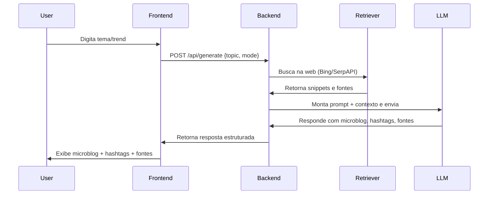

Com certeza! Abaixo está um **PRD prático, detalhado em passos**, para o **MVP: RAG com Web Search** no Microblog A.I, desde o ponto de vista de um engenheiro de software. A ideia é que qualquer dev/engenheiro consiga entender exatamente o que precisa ser feito, do início ao fim do use case, incluindo arquitetura, pontos de decisão, stack e dicas para validação.

---

# PRD — MVP: RAG com Web Search

## Microblog A.I

---

## **Resumo do Use Case**

**Objetivo:**
Permitir que um usuário gere um microblog contextualizado, utilizando informações atualizadas extraídas da web (tendências, notícias, tópicos virais), tudo orquestrado via pipeline RAG (Retrieval Augmented Generation).

---

## **1. Fluxo End-to-End (do usuário à entrega do microblog)**

### **1.1. Usuário interage com a interface (UI)**

* Usuário acessa página principal do Microblog A.I (Next.js).
* Digita (ou seleciona) um tema/tópico (ex: “inteligência artificial”, “Oscar 2025”, “novidades JavaScript”).
* (Opcional: Seleciona se quer usar “Trending Topics”, “Notícias Recentes” ou “Ambos”).
* Clica em “Gerar Microblog”.

### **1.2. Frontend envia requisição para backend**

* Chamada POST para `/api/generate` com payload:

  ```json
  {
    "topic": "Oscar 2025",
    "mode": "trend" // ou "news", ou "all"
  }
  ```

### **1.3. Backend aciona pipeline RAG**

**Arquitetura (API Route Next.js + LangChain.js):**

* Recebe request do frontend.
* Inicializa pipeline LangChain.js:

  * Define retriever (Web Search Retriever).

    * **Bing Search API** (ou SerpAPI) configurada com chave e limites.
  * Define prompt template para LLM.
* Realiza busca na web com o termo/tópico fornecido.

  * Exemplo de busca: “Oscar 2025 news” ou “trending topics AI 2025”.
* Extrai snippets (trechos relevantes) dos resultados (resumo, título, fonte).
* Monta contexto para prompt, ex:

  ```
  Baseie sua resposta nas informações abaixo:
  - [Título/Fonte1]: [snippet]
  - [Título/Fonte2]: [snippet]
  ...  
  Gere um microblog curto, original e informativo sobre "[tema]", use hashtags e referências relevantes.
  ```

### **1.4. LLM gera resposta**

* Pipeline envia prompt enriquecido para o **OpenAI GPT-4o** (ou outro LLM compatível).
* LLM responde com:

  * Texto do microblog (otimizado, pronto para postar)
  * Lista de hashtags sugeridas
  * Insights/contexto (opcional)
  * Referências/fontes (links dos snippets usados)

### **1.5. Backend retorna resposta para o frontend**

* Payload de resposta:

  ```json
  {
    "mainContent": "Aqui está seu microblog sobre o Oscar 2025...",
    "hashtags": ["#Oscar2025", "#Cinema", ...],
    "insights": ["Publique durante o evento para mais engajamento", ...],
    "references": [
      { "title": "Globo News - Oscar 2025", "url": "https://...", "excerpt": "Cerimônia será em março..." },
      ...
    ]
  }
  ```

### **1.6. Frontend exibe resultado**

* Usuário visualiza o microblog, pode copiar texto, hashtags, links, visualizar fontes (badge “Trending” ou “News”).
* Pode ajustar tema e repetir o processo.

---

## **2. Passo a Passo de Implementação**

### **2.1. Preparação do Projeto**

* Certifique-se que seu projeto já usa Next.js, TypeScript e LangChain.js como dependência.
* Configure chaves de API (Bing Search ou SerpAPI) via `.env` e variáveis de ambiente seguras.

### **2.2. Criação do Retriever (LangChain.js)**

* Implemente um retriever web na camada backend:

  ```ts
  import { BingSearchAPIRetriever } from "langchain/retrievers/web_search";
  // ou
  import { SerpAPIRetriever } from "langchain/retrievers/web_search";
  ```
* Defina a quantidade de resultados e snippets a recuperar.

### **2.3. Design do Prompt Template**

* Crie template robusto para injetar contexto e instruções claras para o LLM:

  ```text
  Você é um especialista em social media. Baseie sua resposta nas informações a seguir:
  - [Título/Fonte1]: [snippet]
  - [Título/Fonte2]: [snippet]
  ...
  Gere um microblog único e relevante sobre "[TÓPICO]". Inclua hashtags otimizadas. Cite fontes.
  ```

### **2.4. Integração com OpenAI (LLM)**

* Utilize SDK oficial da OpenAI.
* Envie prompt montado com contexto web.
* Receba resposta estruturada.

### **2.5. Tratamento de Resposta & UX**

* Estruture a resposta para exibir: texto, hashtags, insights, fontes.
* Badge/banners para “Trending” se origem for trending topics.
* Copy-to-clipboard e UI responsiva.
* Feedback visual para erros de API (rate limit, etc).

### **2.6. Validação e Limitação**

* Implemente rate limiting (por IP/user) no backend para evitar abuso/custos.
* Valide tamanho e formato dos prompts e respostas.

### **2.7. Logging, Observability e Testes**

* Adicione logs de erros e tracing (Sentry, Pino).
* Crie testes unitários e de integração para a pipeline.
* Monitore uso das APIs para ajuste de custo/performance.

---

## **3. Stack Detalhado**

* **Frontend:** Next.js, TypeScript, Tailwind CSS, shadcn/ui.
* **Backend:** Next.js API, Node.js 20+, LangChain.js.
* **Retriever:** Bing Web Search API (principal), SerpAPI (opcional/futuro).
* **LLM:** OpenAI GPT-4o (API).
* **Observability:** Sentry, Pino.
* **Auth:** Clerk/Auth.js.
* **Infra:** Vercel/Azure.

---

## **4. Considerações Finais e Boas Práticas**

* Foco em clareza do fluxo para creators (resposta rápida, conteúdo contextualizado, sempre citar fonte).
* Prompts curtos, objetivos e sempre com contexto real, evitando hallucination do modelo.
* Design preparado para logs/auditoria, futura orquestração com Agents.
* Roadmap pronto para expansão para outros formatos (threads, carrosséis), e novas fontes de tendências (Twitter, YouTube, Google Trends).

---

## **Resumo Visual**

