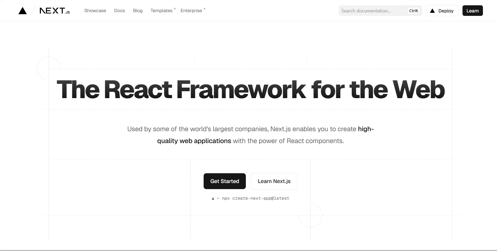
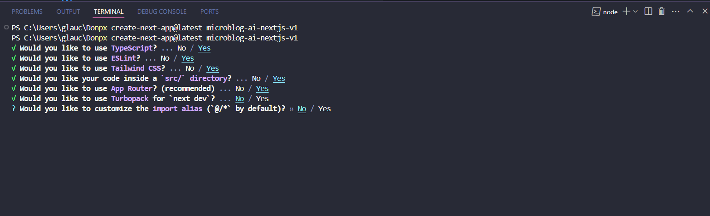
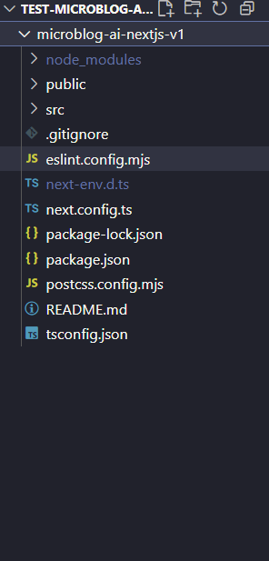
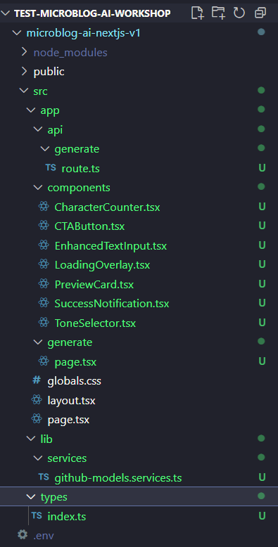

# Creating the Base Project for Microblog A.I with Next.js

In this section, we’ll create our project from scratch, understanding each decision and command. We'll build the foundation of our microblog using Next.js and install the necessary dependencies.

## Starting Our Journey

Imagine you’ve just received a new project to develop a microblog using artificial intelligence. The first step is to prepare your workspace. Open your terminal and navigate to where you store your projects:

```bash
cd ~/projects
```

If you don’t have a `projects` folder, now is a good time to create one:

```bash
mkdir -p ~/projects
cd ~/projects
```

## Creating the Project with Next.js



**[Next.js](https://nextjs.org/)** is a React framework that enables fast and easy web application development. It provides features like server-side rendering, static site generation, and more. To create our project, we’ll use the `npx create-next-app` command:

```bash
npx create-next-app@latest microblog-ai-nextjs
```

After running this command, the terminal will ask you several questions. Each choice is important to define how our project will be structured. Here’s an explanation:

* **Would you like to use TypeScript? (YES):** TypeScript helps write safer code by catching errors during development instead of in production.

* **Would you like to use ESLint? (YES):** ESLint acts like a code reviewer, checking for best practices and potential issues.

* **Would you like to use Tailwind CSS? (YES):** Tailwind CSS is a utility-first styling library that allows you to build beautiful, responsive interfaces quickly.

* **Would you like your code inside a src/ directory? (YES):** This keeps the project organized by separating source code from config files.

* **Would you like to use App Router? (YES):** The App Router is the newer and more intuitive way to handle routing in Next.js.

* **Would you like to use Turbopack for next dev? (NO):** Turbopack is still in development. We’ll stick to stable tools for now.

* **Would you like to customize the import alias? (NO):** The default alias `@/*` is perfect for this project. It allows cleaner imports like `@/components/Button`.

Your final selections should look like the image below:



## Project Structure

Now, navigate into the project folder:

```bash
cd microblog-ai-nextjs
```

Open the project in Visual Studio Code:

```bash
code .
```

When you open the project, you’ll see the folder and file structure generated by Next.js. From here, we’ll begin developing our microblog using best practices and modern tools.



## Installing Essential Dependencies

Our project needs a few additional tools to work properly. Let’s install the following:

```bash
npm install @heroicons/react dotenv openai
```

Why each one?

* `@heroicons/react`: Provides ready-to-use icons that pair well with Tailwind CSS.
* `dotenv`: Loads environment variables from a `.env` file—ideal for sensitive data like API keys. We’ll use it to store the OpenAI API key provided via GitHub Models.
* `openai`: The official OpenAI SDK to interact with the OpenAI API and its language models.

## Setting Up the Environment

Create a `.env` file in the root of the project:

```bash
touch .env
```

Then, add the following to the file:

```bash
NEXT_PUBLIC_GITHUB_MODELS_TOKEN=""
NEXT_PUBLIC_GITHUB_MODELS_ENDPOINT=https://models.inference.ai.azure.com
```

Leave the TOKEN empty for now—we’ll fill it in once we get GitHub Models access.

Now let’s make a small update to the ESLint configuration. Open the `eslint.config.mjs` file and add the following:

```javascript
import { dirname } from "path";
import { fileURLToPath } from "url";
import { FlatCompat } from "@eslint/eslintrc";

const __filename = fileURLToPath(import.meta.url);
const __dirname = dirname(__filename);

const compat = new FlatCompat({
  baseDirectory: __dirname,
});

const eslintConfig = [
  ...compat.config({
    extends: ["next/core-web-vitals", "next/typescript"],
    rules: {
      '@typescript-eslint/no-explicit-any': 'off',
      '@typescript-eslint/no-unused-vars': 'off'
    }
  })
];

export default eslintConfig;
```

## Cleaning the Initial Project

Next.js includes some sample files that we don’t need. Let’s clean those up.

First, remove the unnecessary files:

```bash
rm -rf src/app/favicon.ico
```

Now, create the following folder structure:

```markdown
- src:
  - app:
    - api
      - generate
        - route.ts
    - components
      - CharacterCounter.tsx
      - CTAButton.tsx
      - EnhancedTextInput.tsx
      - LoadingOverlay.tsx
      - PreviewCard.tsx
      - SuccessNotification.tsx
      - ToneSelector.tsx
    - generate
      - page.tsx
  - lib
    - services
      - github-models.services.ts
  - types
    - index.ts
```

You can refer to the project structure image if needed:



## Modifying the `globals.css` File

Let’s add some global styling to ensure a consistent appearance.

Open `globals.css` and update it with the following:

<details><summary><b>src/app/globals.css</b></summary>
<br/>

```css
@import "tailwindcss";

:root {
  --background: #ffffff;
  --foreground: #171717;
}

@theme inline {
  --color-background: var(--background);
  --color-foreground: var(--foreground);
  --font-sans: Inter, ui-sans-serif, system-ui, sans-serif;
  --font-mono: var(--font-geist-mono);
}

@media (prefers-color-scheme: dark) {
  :root {
    --background: #0a0a0a;
    --foreground: #ededed;
  }
}

body {
  background: var(--background);
  color: var(--foreground);
  font-family: var(--font-sans);
}

@keyframes slide-up {
  from {
    transform: translateY(100%);
    opacity: 0;
  }
  to {
    transform: translateY(0);
    opacity: 1;
  }
}

.animate-slide-up {
  animation: slide-up 0.3s ease-out;
}

.backdrop-blur-xs {
  backdrop-filter: blur(2px);
}
```

</details>
<br/>

This CSS defines base colors and fonts. Tailwind takes care of the rest!

## Creating Our First Page

Open the `src/app/page.tsx` file and replace the content with:

<details><summary><b>src/app/page.tsx</b></summary>
<br/>

```tsx
export default function Home() {
  return (
    <main className="flex min-h-screen flex-col items-center justify-between p-24">
      <h1 className="text-4xl font-bold">
        Microblog AI Generator
      </h1>
    </main>
  )
}
```

</details>
<br/>

Let’s test everything. In your terminal, run:

```bash
npm run dev
```

Then open your browser at [http://localhost:3000](http://localhost:3000). You should see “Microblog AI Generator” centered on the screen.

If you see that, congrats! You now have a fully working Next.js app!


## Next Steps

In the next session, we’ll start developing the components that will power our microblog generator. See you there!

**[⬅️ Back: Environment Setup & GitHub Models](./02-configure-environment-gh-models.md) | [Next: Session 04 ➡️](./04-initial-structure-components-ctabutton.md)**

