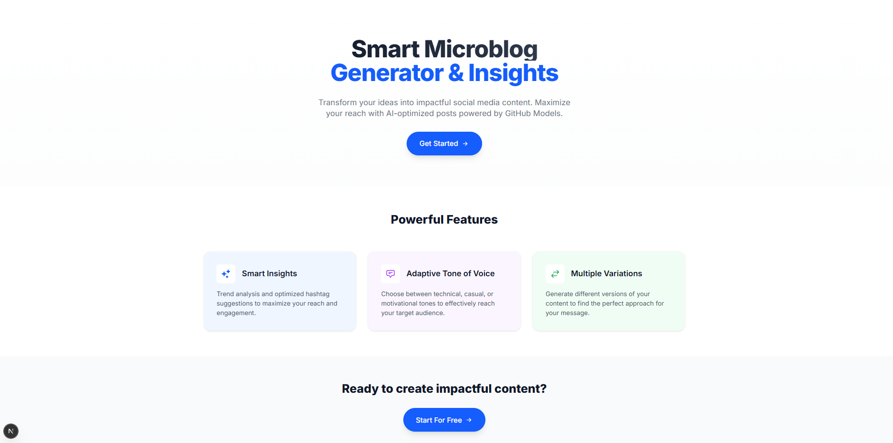

# Base Structure, Typing, and Creating the First Reusable Components

In this session, we’ll establish the fundamental structure of our **Smart Microblog Generator** application. We’ll start by defining TypeScript types to ensure data consistency, setting up the main layout of the application, and creating our first reusable component. This will allow us to build a solid foundation for the app, making it easier to add new features in the future.

We’ll also create our first reusable component, the `CTAButton`, which will be used across different parts of the application. This component will demonstrate how to build styled and interactive buttons using Tailwind CSS.

Let’s get started!

## Defining TypeScript Typing

TypeScript helps us catch errors before runtime and provides smart autocomplete and live documentation of our code. For an AI-integrated application, having well-defined types is crucial as it ensures the data we work with is always in the expected format.

### Creating the Types File

First, let’s create the `src/types/index.ts` file, which will centralize all type definitions for our application.

<details><summary><b>src/app/globals.css</b></summary>
<br/>

```typescript
export interface GeneratedContent {
  mainContent: string;    // The main text of the microblog
  hashtags: string[];     // Array of suggested hashtags
  insights: string[];     // Insights and tips related to the content
}

// Interface for the content generation form state
export interface FormState {
  topic: string;              // Topic to generate content about
  toneOfVoice: ToneOfVoice | string;   // Selected tone of voice
  keywords: string;           // Optional keywords
}

// Generic interface for API responses
export interface ApiResponse<T> {
  success: boolean;    // Indicates if the operation was successful
  data?: T;           // Returned data (when success = true)
  error?: string;     // Error message (when success = false)
}

// Interface for generation request
export interface GenerateApiRequest {
  topic: string;       // Required topic
  tone: string;        // Tone of voice
  keywords?: string;   // Optional keywords
}

// Interface for generation response
export interface GenerateApiResponse {
  success: boolean;
  content?: GeneratedContent;  // AI-generated content
  error?: string;
}
```

</details>
<br/>

### 💡 Detailed Explanation

#### 1. `ToneOfVoice` Type Union

```typescript
export type ToneOfVoice = "friendly" | "professional" | "casual" | "inspirational";
```

* We use a union type to limit tone of voice options
* This prevents typos and ensures consistency
* TypeScript will suggest only these options in autocomplete

#### 2. `GeneratedContent` Interface

```typescript
export interface GeneratedContent {
  mainContent: string;
  hashtags: string[];
  insights: string[];
}
```

* Clearly defines what we expect to receive from the AI
* `hashtags` and `insights` are arrays for easy iteration in the UI
* All fields are required (no `?`)

#### 3. Generic `ApiResponse` Pattern

```typescript
export interface ApiResponse<T> {
  success: boolean;
  data?: T;
  error?: string;
}
```

* A generic interface reusable for any API response
* The generic `<T>` allows flexible typing
* Optional fields (`?`) for `data` and `error` depending on the context

## Setting Up the Main Layout

### Understanding Layout in Next.js

The `layout.tsx` file is special in Next.js (version 13+). It defines the base structure that wraps all pages of the application, including SEO metadata, fonts, and global styles.

### Implementing the Root Layout

Let’s create the `src/app/layout.tsx` file which will serve as the main layout of our app. This layout will include the custom font and global styles.

<details><summary><b>src/app/layout.tsx</b></summary>
<br/>

```tsx
import type { Metadata } from "next";
import { Inter } from "next/font/google";
import "./globals.css";

// Inter font configuration from Google Fonts
const inter = Inter({ 
  subsets: ["latin"],
  variable: "--font-inter",
});

// Application metadata for SEO
export const metadata: Metadata = {
  title: "Smart Microblog Generator | Create Impactful Contents with AI",
  description: "Transform your ideas into engaging microblogs with AI. Generate optimized social media content with different tones of voice and trend-based insights.",
  keywords: [
    "microblogging",
    "AI content generation", 
    "social media",
    "content creation",
    "smart microblog",
    "AI writing assistant",
    "content optimization",
    "engaging content",
    "social media strategy",
  ],
  authors: [{ 
    name: "Glaucia Lemos", 
    url: "https://www.youtube.com/@GlauciaLemos" 
  }],
  openGraph: {
    title: "Smart Microblog Generator",
    description: "Transform your ideas into engaging microblogs with AI.",
    type: "website",
  },
};

// Root layout component
export default function RootLayout({
  children,
}: Readonly<{
  children: React.ReactNode;
}>) {
  return (
    <html lang="en" className={inter.variable}>
      <body className="antialiased">
        {children}
      </body>
    </html>
  );
}
```

</details>
<br/>

### 🔍 Layout Analysis

#### 1. Font Configuration

```tsx
const inter = Inter({ 
  subsets: ["latin"],
  variable: "--font-inter",
});
```

* `Inter` is a modern, readable font ideal for web apps
* `subsets: ["latin"]` optimizes loading with only necessary characters
* `variable` defines a CSS variable usable with Tailwind

#### 2. SEO Metadata

```tsx
export const metadata: Metadata = {
  title: "Smart Microblog Generator | Create Impactful Contents with AI",
  // ...
};
```

* `title` appears in the browser tab and search results
* `description` is critical for SEO and shows in search previews
* `keywords` help search engines understand the page
* `openGraph` improves sharing on social networks

#### 3. HTML Structure

```tsx
return (
  <html lang="en" className={inter.variable}>
    <body className="antialiased">
      {children}
    </body>
  </html>
);
```

* `lang="en"` improves accessibility and SEO
* `className={inter.variable}` applies the custom font
* `antialiased` smooths text rendering
* `{children}` is where page content is rendered

## Creating the `CTAButton` Component

### Design System Concepts

A good design system starts with base reusable components. Our `CTAButton` demonstrates how to build flexible components with style variations.

### Implementing the `CTAButton`

Create the file `src/app/components/CTAButton.tsx` and add the following code:

<details><summary><b>src/app/components/CTAButton.tsx</b></summary>
<br/>

```tsx
import Link from "next/link";

interface CTAButtonProps {
  href: string;
  children: React.ReactNode;
  variant?: 'primary' | 'secondary';
}

export default function CTAButton({
  href,
  children,
  variant = 'primary',
}: CTAButtonProps) {
  const baseClasses = 'inline-flex items-center px-8 py-4 text-lg font-medium rounded-full shadow-lg transition-all duration-300 transform hover:-translate-y-0.5 group';

  const variantClasses = {
    primary: 'text-white bg-blue-600 hover:bg-blue-700 hover:shadow-xl focus:outline-none focus:ring-2 focus:ring-offset-2 focus:ring-blue-500',
    secondary: 'text-gray-700 bg-gray-200 hover:bg-gray-300 hover:shadow-xl focus:outline-none focus:ring-2 focus:ring-offset-2 focus:ring-gray-500'
  }

  return (
    <Link
      href={href}
      className={`${baseClasses} ${variantClasses[variant]}`}
    >
      <span>{children}</span>
      <svg
        className='w-5 h-5 ml-2 transform group-hover:translate-x-1 transition-transform duration-200'
        fill='none'
        stroke='currentColor'
        viewBox='0 0 24 24'
      >
      <path
        strokeLinecap='round'
        strokeLinejoin='round'
        strokeWidth={2}
        d='M13 7l5 5m0 0l-5 5m5-5H6'
      />
      </svg>
    </Link>
  );
}
```

</details>
<br/>

### 🎨 Component Design Breakdown

#### 1. TypeScript Interface

```tsx
interface CTAButtonProps {
  href: string;                
  children: React.ReactNode;   
  variant?: 'primary' | 'secondary'; 
}
```

* `href`: required for navigation
* `children`: allows flexible content (text, icons, etc.)
* `variant`: optional with a default value

#### 2. CSS Class System

```tsx
const baseClasses = `
  inline-flex items-center px-8 py-4 text-lg font-medium 
  rounded-full shadow-lg transition-all duration-300 
  transform hover:-translate-y-0.5 group
`;
```

* `inline-flex items-center`: aligns content horizontally
* `px-8 py-4`: ensures proper padding for touch/click
* `rounded-full`: fully rounded corners
* `transform hover:-translate-y-0.5`: creates a hover lift effect
* `group`: enables coordinated hover animations

#### 3. Style Variants

```tsx
const variantClasses = {
  primary: "text-white bg-blue-600 hover:bg-blue-700...",
  secondary: "text-gray-700 bg-gray-200 hover:bg-gray-300..."
};
```

* Each variant has its own color scheme
* Hover states are predefined
* Focus states include rings for accessibility

#### 4. Arrow Animation

```tsx
<svg className="w-5 h-5 ml-2 transform group-hover:translate-x-1 transition-transform duration-200">
```

* `group-hover:translate-x-1`: animates the arrow on hover
* `transition-transform duration-200`: smooths the animation
* The icon is inline SVG for maximum control

## Creating the Main Page (Home Page)

### Effective Landing Page Concepts

A well-crafted landing page is key to converting visitors into users. Our homepage will follow a classic structure: **Hero Section** (initial impact), **Features Section** (value demonstration), and **Final CTA** (call to action).

### Implementing the Home Page

Now let’s create our main page in `src/app/page.tsx`. This file will automatically serve as the root route (`/`) of our application:

<details><summary><b>src/app/page.tsx</b></summary>
<br/>

> *(Code remains the same as it's already written in English in your original message)*

</details>
<br/>

### 🎨 Detailed Implementation Analysis

#### 1. Icon System with `Heroicons`

```tsx
import { SparklesIcon } from "@heroicons/react/16/solid";
import { 
  ChatBubbleBottomCenterTextIcon,
  ArrowsRightLeftIcon
} from "@heroicons/react/24/outline";
```

* **Why Heroicons?**

  * **Visual Consistency:** All icons follow the same design style
  * **Two Variants:** solid (filled) and outline (stroked)
  * **Optimized Sizes:** 16px for small, 24px for medium icons
  * **Native SVG:** Scalable and performant
  * **Tailwind Integration:** Perfectly aligned with Tailwind utility classes

#### 2. `Feature` Interface and Structured Typing

```tsx
interface Feature {
  icon: React.ReactNode;    
  title: string;           
  description: string;     
  bgColor: string;         
  iconColor: string;       
}
```

* **Benefits of This Structure:**

  * **Reusability:** Makes it easy to add new features
  * **Consistency:** Ensures all cards have the same shape
  * **Maintainability:** Centralizes data in one place
  * **Type Safety:** TypeScript prevents property errors

#### 3. Features Array with Design System

```tsx
const features: Feature[] = [
  {
    icon: <SparklesIcon className="w-6 h-6" />,
    title: "Smart Insights",
    description: "Trend analysis and optimized hashtag suggestions...",
    bgColor: "bg-blue-50 dark:bg-blue-900/20",
    iconColor: "text-blue-600 dark:text-blue-400",
  },
  // ...
];
```

* **Systematic Color Scheme:**

  * Feature 1 (Insights): Blue – associated with intelligence and technology
  * Feature 2 (Tone of Voice): Purple – associated with creativity and communication
  * Feature 3 (Variations): Green – associated with growth and success

* **Dark Mode Support:**

  * Each color has a dark theme variation (`dark:`)
  * Reduced opacity (`/20`) for subtle backgrounds in dark mode
  * Lighter text/icon colors for better contrast

#### 4. Design Strategies

* **Responsive Padding:** `px-4 sm:px-6 lg:px-8` adjusts spacing based on screen size
* **Vertical Spacing:** `pt-24 pb-20` creates breathing room
* **Max Width Control:** `max-w-7xl` prevents overly wide lines on large screens
* **Center Alignment:** `mx-auto text-center` focuses attention on the content

Open your browser and go to `http://localhost:3000` to see the homepage in action.



Pretty cool, right? We now have a functional homepage with a responsive and styled layout, along with a reusable `CTAButton` component that can be used across different parts of the application.

Shall we move on to some exercises?

## 🧪 Advanced Practical Exercises

### 1. **Add Entry Animations**

Implement staggered animations for the feature cards:

```tsx
// Tip: Use transition delays based on index
className={`... transition-all duration-300 delay-${index * 100}`}
```

### 2. Create a Fourth Feature

Add a new feature item to the array:

```tsx
{
  icon: < /* Choose an appropriate icon */ />,
  title: "Analytics Dashboard",
  description: "Track performance metrics...",
  bgColor: "bg-orange-50 dark:bg-orange-900/20",
  iconColor: "text-orange-600 dark:text-orange-400",
}
```

### 3. Implement Smooth Scroll

Enable smooth scrolling between sections:

```tsx
// Add IDs to sections and modify the CTAButtons
<section id="features" className="...">
<CTAButton href="#features">Learn More</CTAButton>
```

### 4. Add Visual Metrics

Include a section with impressive numbers:

```tsx
const stats = [
  { number: "10K+", label: "Posts Generated" },
  { number: "95%", label: "Engagement Increase" },
  { number: "500+", label: "Happy Users" }
];
```

> **💡 Pro Tip:** Always test your landing page on real devices and under different network conditions to ensure a consistent experience!

## Next Steps

In **Session 05 – Integration with Artificial Intelligence and GitHub Models**, we’ll dive into the heart of our application. You will learn how to:

* **Integrate GitHub Models** into your Next.js application, leveraging cutting-edge AI models for free
* **Build a robust AI service** using professional standards for retry logic and error handling
* **Develop effective prompts** for different tones of voice (technical, casual, motivational)
* **Implement multi-layered validation** to ensure response quality and consistency
* **Apply the Singleton pattern**


**[⬅️ Back: Creating the Microblog A.I Base Project with Next.js](./03-initial-project-nextjs.md) | [Next: Session 05 ➡️](./05-integration-with-ai.md)**
