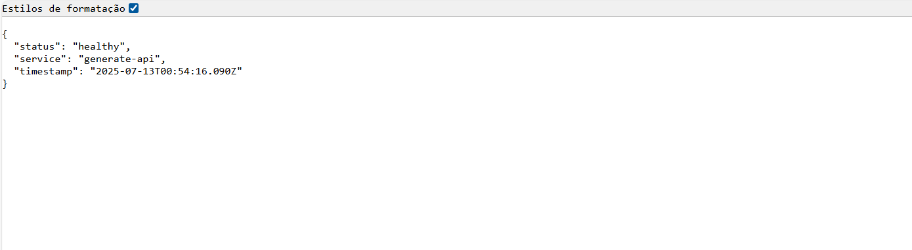
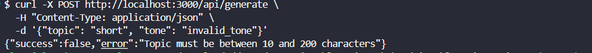

# Integration with the Content Generation API

Now that our AI service is working perfectly, it’s time to build a robust production-grade API that can handle real traffic. In this session, we’ll develop a complete API route that includes rate limiting, advanced validation, sophisticated error handling, and performance optimizations. We’ll transform our test API into a production-ready endpoint.

## Learning Objectives

By the end of this session, you will be able to:

* Implement effective rate limiting in Next.js applications
* Create multi-layered validation systems for robust APIs
* Develop categorized and informative error handling
* Optimize HTTP headers for performance and caching
* Implement health checks for application monitoring
* Apply security principles to public APIs

## Step 1: Creating the Production API Structure

### Evolving from Test API to Production

Our test API worked perfectly to validate the integration, but a production API requires much more robustness. We’ll create the file `src/app/api/generate/route.ts`, which will be our main content generation endpoint.

<details><summary><b>src/app/api/generate/route.ts</b></summary>
<br/>

```typescript
// src/app/api/generate/route.ts
import { NextRequest, NextResponse } from 'next/server';
import { getGitHubModelsService } from '../../../lib/services/github-models.services'
import type { GenerateApiRequest, GenerateApiResponse } from '@/types';
```

</details>
<br/>

### Understanding the Strategic Imports

In this snippet, we import `NextRequest` and `NextResponse` from Next.js, which allow us to handle HTTP requests and responses with advanced control. We also import our GitHub Models service, which encapsulates all the logic for interacting with the AI API.

We start by importing `NextRequest` and `NextResponse` to gain full access to Next.js's advanced capabilities for managing HTTP request/response cycles. These classes offer more sophisticated methods than the traditional Node.js `Request` and `Response` objects.

Importing the GitHub Models service helps maintain a clear separation of concerns. The API route handles only the HTTP interface, while all business logic remains encapsulated within the service.

The `GenerateApiRequest` and `GenerateApiResponse` types we defined earlier ensure full type safety across our API, preventing runtime errors and improving the developer experience.

Aqui está a tradução completa para o inglês do **Passo 2: Implementando Rate Limiting Inteligente**:

## Step 2: Implementing Smart Rate Limiting

### Setting Up the Rate Limiting System

To prevent abuse and ensure our API can handle real-world traffic, we’ll implement rate limiting.

<details><summary><b>src/app/api/generate/route.ts (continued)</b></summary>
<br/>

```typescript
// Rate limiting configuration
const RATE_LIMIT_WINDOW = 60 * 1000; // 1 minute
const MAX_REQUESTS_PER_WINDOW = 10;
const requestCounts = new Map<string, { count: number; resetTime: number }>();
```

</details>
<br/>

### Understanding the Rate Limiting Architecture

Rate limiting is essential to protect our API from abuse and ensure fair resource distribution among all users. We configure a time window of 60 seconds with a maximum of 10 requests per client.

We use an in-memory `Map` to store counters per client. Each entry holds the current request count and a timestamp indicating when the counter should reset. This approach is efficient for medium-scale applications and does not require additional infrastructure like Redis.

The structure `{ count: number; resetTime: number }` enables a simple but effective sliding window rate limiting strategy. The `resetTime` determines when the counter resets to zero, creating consistent time windows.

### Implementing the Rate Limiting Logic

<details><summary><b>src/app/api/generate/route.ts (continued)</b></summary>
<br/>

```typescript
// Rate limiting implementation
function checkRateLimit(clientId: string): boolean {
  const now = Date.now();
  const clientData = requestCounts.get(clientId);

  if (!clientData || now > clientData.resetTime) {
    requestCounts.set(clientId, {
      count: 1,
      resetTime: now + RATE_LIMIT_WINDOW,
    });
    return true;
  }

  if (clientData.count >= MAX_REQUESTS_PER_WINDOW) {
    return false;
  }

  clientData.count += 1;
  return true;
}
```

</details>
<br/>

### Analyzing the Rate Limiting Logic

The `checkRateLimit` function implements an elegant traffic control strategy. First, we check if there is a record for the current client. If there isn’t one, or if the time window has expired, we create a new record and allow the request.

If the client is still within the time window, we check if they’ve reached the maximum number of allowed requests. If so, we block the request by returning `false`. Otherwise, we increment the counter and allow the request. This approach is efficient and thread-safe in the context of a single Node.js instance, ensuring that all rate limiting operations have O(1) complexity.

The check `now > clientData.resetTime` ensures that time windows are respected. When a window expires, the counter is automatically reset, giving the client a new window for requests.

This implementation is thread-safe in single-instance Node.js environments and delivers excellent performance with constant time complexity for all operations.

## Step 3: Developing Robust Input Validation

### Creating the Validation System

<details><summary><b>src/app/api/generate/route.ts (continued)</b></summary>
<br/>

```typescript
// Input validation
function validateRequest(body: any): GenerateApiRequest | null {
  const { topic, tone, keywords } = body;

  if (!topic || typeof topic !== 'string') {
    return null;
  }

  if (!tone || typeof tone !== 'string') {
    return null;
  }

  if (keywords !== undefined && typeof keywords !== 'string') {
    return null;
  }

  return { topic: topic.trim(), tone: tone.toLowerCase(), keywords: keywords?.trim() };
}
```

</details>
<br/>

### Understanding the Principles of Validation

Our validation function follows the *fail fast* principle combined with automatic data sanitization. Each field is checked for both presence and correct type, ensuring that invalid data is immediately rejected.

The validation for the *topic* field ensures it exists and is a non-empty string. The `!topic` check captures null, undefined, empty strings, and other falsy values, offering comprehensive coverage.

For *keywords*, we apply conditional validation. If the field is present, it must be a string—but it’s also completely optional. This offers flexibility for API clients without sacrificing robustness.

Automatic sanitization using `trim()` removes unnecessary whitespace, and `toLowerCase()` normalizes the tone of voice. These transformations ensure consistent data is passed into our AI service.

### Implementing Advanced Validations

<details><summary><b>src/app/api/generate/route.ts (continued)</b></summary>
<br/>

```typescript
// Additional validation
if (validatedData.topic.length < 10 || validatedData.topic.length > 280) {
  return NextResponse.json(
    { success: false, error: 'Topic must be between 10 and 280 characters' },
    { status: 400 }
  );
}

const validTones = ['technical', 'casual', 'motivational'];
if (!validTones.includes(validatedData.tone)) {
  return NextResponse.json(
    { success: false, error: 'Invalid tone of voice' },
    { status: 400 }
  );
}
```

</details>
<br/>

### Strategy Behind Advanced Validations

The length validations are not arbitrary. The minimum of 10 characters ensures we have enough context for the AI to generate meaningful content. The 200-character maximum prevents abuse and ensures the resulting prompt remains within reasonable bounds.

Tone validation using a whitelist is a key security practice. Instead of assuming any value is valid, we explicitly define the allowed tones. This prevents injection attacks and ensures only tones with predefined guidelines are processed.

The error responses are structured and consistent, always including `success: false` and a clear error message. The HTTP status code `400 Bad Request` clearly communicates that the issue lies with the client’s submitted data.

## Step 4: Building the Main Endpoint

### Implementing the Core API Logic

Now that we have rate limiting and robust validation, let’s implement the core logic of the endpoint.

<details><summary><b>src/app/api/generate/route.ts (continued)</b></summary>
<br/>

```typescript
export async function POST(request: NextRequest) {
  try {
    // Extract client identifier (IP or session)
    const clientId = request.headers.get('x-forwarded-for') || 
                    request.headers.get('x-real-ip') || 
                    'anonymous';
    
    // Check rate limit
    if (!checkRateLimit(clientId)) {
      return NextResponse.json(
        { success: false, error: 'Rate limit exceeded. Please try again later.' },
        { status: 429 }
      );
    }
    
    // Parse and validate request body
    const body = await request.json();
    const validatedData = validateRequest(body);
    
    if (!validatedData) {
      return NextResponse.json(
        { success: false, error: 'Invalid request data' },
        { status: 400 }
      );
    }
```

</details>
<br/>

### Analyzing Client Identification

Proper client identification is essential for effective rate limiting. We use a cascading strategy that first checks for proxy headers like `x-forwarded-for`, then `x-real-ip`, and finally falls back to `'anonymous'`.

This approach is important because, in production environments—especially when using CDNs like Cloudflare or load balancers—the client’s real IP may be stored in specific headers. The fallback to `'anonymous'` ensures that the system continues to function even when a specific client cannot be identified.

The order of the headers is intentional: `x-forwarded-for` is the most common standard for HTTP proxies, while `x-real-ip` is used by some load balancers. This flexibility ensures compatibility across different infrastructures.

### Processing Content Generation

<details><summary><b>src/app/api/generate/route.ts (continued)</b></summary>
<br/>

```typescript
// Generate content using the service
const service = getGitHubModelsService();
const generatedContent = await service.generateMicroblogContent(
  validatedData.topic,
  validatedData.tone,
  validatedData.keywords
);

// Return successful response
const response: GenerateApiResponse = {
  success: true,
  content: generatedContent,
};

return NextResponse.json(response, {
  status: 200,
  headers: {
    'Cache-Control': 'no-store, max-age=0',
    'Content-Type': 'application/json',
  },
});
```

</details>
<br/>

### Optimizing Response Headers

Response headers are carefully configured to optimize performance and security. The `Cache-Control: no-store, max-age=0` header ensures that AI-generated content is never cached, since each generation should be unique and context-aware.

The `Content-Type: application/json` header explicitly sets the response format, helping clients properly process the returned data. Although Next.js sets this automatically, being explicit improves clarity and ensures consistency.

The response structure follows the established pattern, using `success: true` and placing the content in the `content` field. This consistency simplifies frontend development and reduces the risk of integration errors.

## Step 5: Implementing Advanced Error Handling

### Creating a Categorized Error Handling System

Now let's implement an error handling system that categorizes different types of failures—from validation errors to issues with the external AI API.

<details><summary><b>src/app/api/generate/route.ts (continued)</b></summary>
<br/>

```typescript
} catch (error) {
  console.error('Generation API error:', error);
  
  // Determine error type and status code
  let statusCode = 500;
  let errorMessage = 'An unexpected error occurred';
  
  if (error instanceof Error) {
    if (error.message.includes('environment variables')) {
      statusCode = 500;
      errorMessage = 'Server configuration error';
    } else if (error.message.includes('Rate limit exceeded')) {
      statusCode = 429;
      errorMessage = 'API rate limit exceeded';
    } else if (error.message.includes('Invalid')) {
      statusCode = 400;
      errorMessage = error.message;
    } else {
      errorMessage = 'Failed to generate content';
    }
  }
  
  return NextResponse.json(
    { success: false, error: errorMessage },
    { status: statusCode }
  );
}
```

</details>
<br/>

### Understanding Error Categorization

This error handling system categorizes different failure types to provide appropriate responses. Environment configuration errors result in a 500 (Internal Server Error) status, since these are server-side issues the client cannot resolve.

Rate limiting errors return status 429 (Too Many Requests), a specific code that allows clients to implement automatic backoff. This specificity also helps monitoring tools detect distinct problem patterns.

Validation errors return a 400 (Bad Request) status and preserve the original message when possible. This gives developers clear feedback when integrating with our API.

For uncategorized errors, we provide a generic but helpful message. This avoids leaking sensitive internal details while ensuring detailed logs are captured for debugging.

### Strategic Logging for Debugging

The line `console.error('Generation API error:', error)` ensures that all errors are logged with full context. In production, these logs are essential for monitoring and troubleshooting intermittent issues.

The logging strategy captures both expected and unexpected errors, providing a complete audit trail. This is critical for identifying recurring issues and improving the resilience of the application.

## Step 6: Adding a Health Check for Monitoring

### Implementing the Health Check Endpoint

Let’s now add a health check endpoint that will allow us to monitor the health of our API and ensure it’s always available.

<details><summary><b>src/app/api/health/route.ts</b></summary>
<br/>

```typescript
// Health check endpoint
export async function GET() {
  return NextResponse.json(
    { 
      status: 'healthy',
      service: 'generate-api',
      timestamp: new Date().toISOString(),
    },
    { status: 200 }
  );
}
```

</details>
<br/>

### Importance of Health Checks

Health checks are essential for production operations. They allow monitoring systems, load balancers, and orchestrators like Kubernetes to verify that the service is responding correctly.

The timestamp included in the response helps determine whether the service is actively processing requests or merely returning a cached response. This information is valuable for diagnosing performance issues.

The service identifier (`'generate-api'`) helps distinguish this health check in microservices environments where many services might expose similar endpoints.

### Expanding Health Checks for Full Validation

In more advanced implementations, the health check could verify connectivity to GitHub Models, validate environment variables, and test other critical components. For now, we’ll keep it simple but functional—ready to expand as needed.

## Step 7: Testing the Production API

### Creating Comprehensive Tests

Now that our API is complete, we can test it in various ways. The simplest tool is the browser itself to test the health check:

```bash
curl -X GET http://localhost:3000/api/generate
```



To test content generation, we can use tools like curl, Postman, or build a simple web interface. Example using curl (via Git Bash terminal):

> Don’t forget to run `npm run dev` to start your Next.js server before testing the API. Then open a new terminal to run the curl command.

```bash
curl -X POST http://localhost:3000/api/generate \
  -H "Content-Type: application/json" \
  -d '{
    "topic": "The future of artificial intelligence in web development",
    "tone": "technical",
    "keywords": "machine learning, automation, efficiency"
  }'
```

If you see something like the image below, everything is working correctly:


### Testing Error Scenarios

It’s also important to test error scenarios to ensure that our API responds appropriately:

* **Rate Limiting Test:**

Run multiple requests quickly to check if rate limiting is working:

```bash
for i in {1..15}; do
  curl -X POST http://localhost:3000/api/generate \
    -H "Content-Type: application/json" \
    -d '{"topic": "test topic for rate limiting", "tone": "casual"}' &
done
```

If everything is working as expected, you’ll receive a `429` error response after the first 10 requests.


* **Validation Test:** Send invalid data to verify if validation is catching errors properly:

```bash
curl -X POST http://localhost:3000/api/generate \
  -H "Content-Type: application/json" \
  -d '{"topic": "short", "tone": "invalid_tone"}'
```

If all is correct, you’ll receive an error message:



### Monitoring Performance

While testing, keep an eye on the terminal where you’re running `npm run dev`. You’ll see valuable information about performance, errors, and rate limiting behavior.

For more advanced tests, consider using tools like Apache Bench (ab) or Artillery to simulate real-world load and see how the API behaves under stress.


## Security and Performance Considerations

### Implemented Security Strategies

Our API implements multiple layers of security. Rate limiting helps prevent denial-of-service attacks and abusive usage of resources. Rigorous input validation prevents injection attacks and ensures only valid data is processed.

Careful error handling avoids leaking sensitive information while still providing useful feedback to legitimate developers. Detailed server-side logs allow for issue investigation without exposing internal details publicly.

### Performance Optimizations

Using the Singleton pattern in the GitHub Models service reuses HTTP connections, reducing latency. The in-memory rate limiting system offers excellent performance without external dependencies.

Appropriate cache headers ensure AI-generated content is not cached incorrectly, maintaining the uniqueness of each response. Early return validation ensures invalid requests are quickly rejected without consuming unnecessary resources.

### Preparing for Scale

While our current implementation is suitable for medium-scale applications, for larger-scale deployments, we would consider distributed rate limiting with Redis, structured logging for automated analysis, detailed metrics for performance monitoring, and circuit breakers to provide resilience against external service failures.

## Advanced Practical Exercises

### Implementing Detailed Metrics

Add a metrics system that tracks response times, most common error types, rate limiting usage, and most requested topics. Create a new endpoint at `/api/generate/metrics` that returns these statistics.

### Expanding Rate Limiting

Implement differentiated rate limiting based on user type. For example, authenticated users could have higher limits. Consider implementing per-endpoint rate limiting in addition to global rate limits.

### Adding Authentication

Implement an API key system that allows user authentication and personalized rate limiting. This prepares the API for commercial use or by third-party developers.

### Enhancing Health Checks

Expand the health check to verify connectivity with GitHub Models, validate critical configuration settings, and report basic performance metrics. Consider implementing different levels of health checks (shallow vs. deep).

## Session Summary and Next Steps

### What We Accomplished

In this session, we built a production-ready API capable of handling real-world traffic. We implemented effective rate limiting to protect against abuse, developed a multi-layer validation system to ensure data quality, and introduced categorized error handling for appropriate feedback.

Our API now includes performance optimizations through appropriate headers and strategic logging, health checks for operational monitoring, and multiple layers of security to defend against common attack vectors.

The architecture is scalable and can be easily extended with additional features like authentication, advanced metrics, and distributed rate limiting as the application grows.

### Preparing for the Next Session

In Session 7, we will build the full user interface that consumes our robust API. We'll develop an intuitive form with real-time validation, implement elegant loading states and visual feedback, and create a smooth user experience that showcases the full power of our AI integration.

We’ll use our production API as the foundation, implementing frontend error handling that mirrors the API's responses and building a complete application ready for production deployment.

> **Pro Tip:** Robust APIs are the foundation of scalable applications. Time invested in validation, error handling, and performance optimization at the API layer pays off multiple times as the application grows. Always consider how your design decisions impact long-term maintainability and scalability.

**[⬅️ Back: Integration with Artificial Intelligence and GitHub Models](./05-initial-structure-components-ctabutton.md) | [Next: Session 07 ➡️](./07-session.md)**


