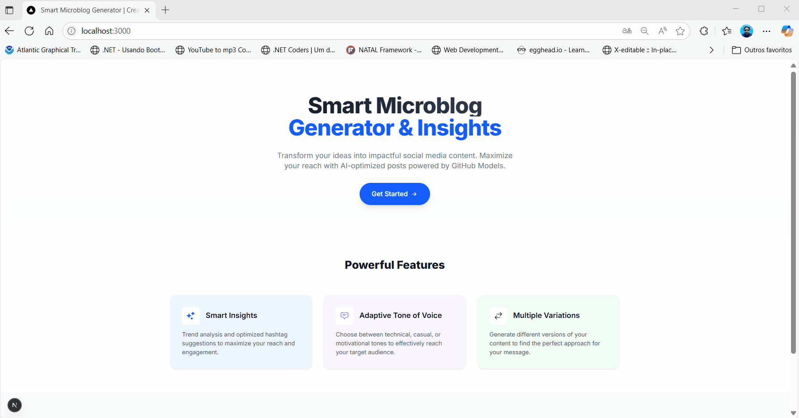

# Session 09: Conclusion and Next Steps

In this final session, we’ll celebrate the achievements made during version 1.0 of our **Microblog AI with Next.js** project. Throughout this journey, you’ve learned and applied advanced techniques that combine JavaScript/TypeScript, React, Next.js, Tailwind CSS, and Artificial Intelligence using GitHub Models (GPT-4o) to build a complete and sophisticated application.

### 🏆 What Have You Learned?

During this workshop, you:

* ✅ Built a robust Next.js application from scratch using TypeScript.
* ✅ Developed reusable React components and modern interfaces with Tailwind CSS.
* ✅ Integrated AI using GitHub Models to generate intelligent content in different tones of voice (technical, casual, motivational).
* ✅ Implemented an advanced hashtag generation system and strategic insights for social media optimization.
* ✅ Built a production-ready API, including rate limiting, multi-layer validation, and advanced error handling.
* ✅ Applied advanced frontend state management to provide a smooth and intuitive user experience.
* ✅ Created rich user interactions with instant visual feedback and enhanced accessibility.

### 🎉 See Your Application in Action:

### 🚧 Future Versions and Learning Opportunities:

This is just the initial version of Microblog AI. In future releases, you can expand your knowledge by implementing even more advanced techniques such as:

* **Version 2.0 (RAG Architecture with LangChain.js)**:

  * Implement Retrieval-Augmented Generation using LangChain.js to enhance response accuracy by combining content generation with external data retrieval.

* **Version 3.0 (Intelligent Agents)**:

  * Develop AI Agents that automate tasks and interact with multiple APIs to deliver even more sophisticated functionalities.

* **Version 4.0 (MCP)**:

  * Explore the Model Context Protocol (MCP) to efficiently manage contexts in more complex applications involving multiple agents and data sources.

* **Version 5.0 (Advanced Deployment)**:

  * Learn about Infrastructure as Code (IaC) using Terraform and perform full cloud deployment (Azure, AWS, or GCP).
  * Configure the application for production using OpenAI APIs with security and scalability in mind.

### 🚀 Practical Challenge (Optional):

To reinforce everything you’ve learned, try implementing an extra feature in your current application, such as:

* A new custom tone of voice.
* Additional improvements to the user interface.
* Functionality to save generated microblogs in local storage or a database.

Share your project with the community or publish it on GitHub to showcase your progress and receive feedback.

### 📚 Recommended Additional Resources:

To continue your learning journey, explore these complementary resources:

* [Next.js Documentation](https://nextjs.org/docs)
* [GitHub Models Marketplace](https://github.com/marketplace?type=models)
* [LangChain.js](https://js.langchain.com/)
* [Terraform IaC](https://www.terraform.io/)
* [Azure Developer CLI](https://azure.github.io/azure-dev/cli/)

### 🙌 Thank You and Feedback

Thank you for participating in this workshop! I hope it was an incredible learning and hands-on experience. Feel free to share suggestions and feedback to help improve future versions.

## Achievement Unlocked 🏆

**Full Stack A.I Engineer**: You’ve successfully designed, built, and deployed a complete application powered by AI using modern technologies and best practices. You're ready to help shape the future of intelligent applications!

See you on the next learning journey! 🚀✨

**[⬅️ Back: Creating the Microblog AI Generator Page](./08-create-microblog-generator-page.md) | [Next: Session 10: Version 2.0 LangChain.js with RAG ➡️](./10-session.md)**
