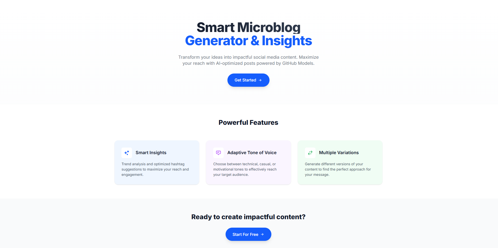
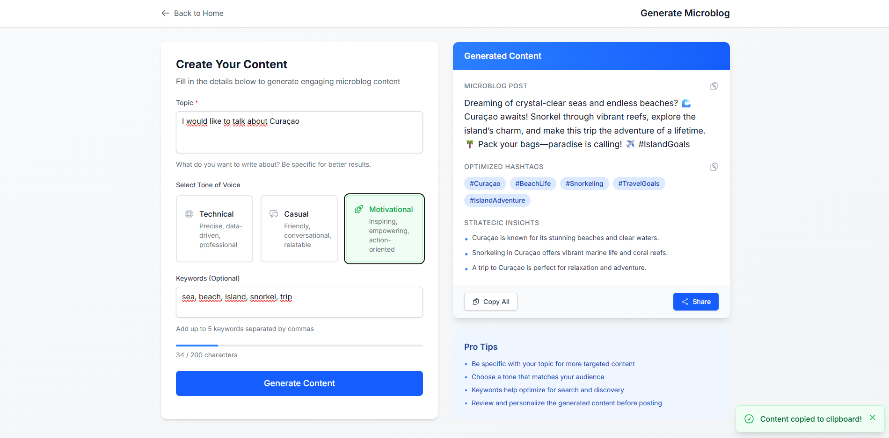

# Workshop: Desenvolva Aplicações Inteligentes com JavaScript/TypeScript e A.I - Zero to Hero!

Sejam todos bem-vindos ao workshop! Neste evento, vamos explorar o poder do JavaScript/TypeScript e da Inteligência Artificial (A.I) para criar aplicações inovadoras e inteligentes. Preparem-se para uma jornada de aprendizado incrível, onde vocês se tornarão especialistas em desenvolver soluções que utilizam A.I de forma eficaz.

A nossa intenção é justamente que você aprenda, desde desenvolver do zero uma aplicação completa utilizando JavaScript/TypeScript e A.I, até implementar funcionalidades avançadas com uso de bibliotecas e frameworks modernos alinhados com Inteligência Artificial.

Ao longo do workshop, abordaremos tópicos como:

- Desenvolvimento do zero de uma aplicação Next.js utilizando TypeScript + LLMs da OpenAI através do GitHub Models.
- Depois, implementaremos arquitetura RAG (Retrieval-Augmented Generation) para melhorar a capacidade de busca e recuperação de informações.
- Uso de Agents para automação de tarefas e integração com APIs.
- MCP (Model Context Protocol)

Será uma jornada incrível onde vocês terão a oportunidade de colocar em prática tudo o que aprenderam, desenvolvendo projetos reais e desafiadores que integrarão A.I de forma inteligente e eficaz. Estamos animados para ver o que vocês criarão!

## O que vamos desenvolver e aprender?

Uma aplicação de geração de conteúdos que se chama: Microblog AI com Next.js

- Na versão 1.0

    - Interface moderna e responsiva utilizando Next.js v15 e em conjunto com o Tailwind CSS
    - Geração de conteúdo com IA usando o **[GitHub Models (OpenAI GPT-4o)](https://github.com/marketplace?type=models)**
    - Três tons de voz diferentes: técnico, casual e motivacional
    - Com otimização de hashtags e insights estratégicos, podendo compartilhar o conteúdo gerado em diferentes plataformas de redes sociais.

- Na versão 2.0: Arquitetura RAG (Retrieval-Augmented Generation) com LangChain.js
- Na versão 3.0: Integração com Agents
- Na versão 4.0: Uso do Model Context Protocol (MCP) com Agents
- Na versão 5.0: Deployment da Aplicação usando conceitos de IaC com Terraform, serviço de nuvem (Azure, AWS ou GCP - o que for da sua escolha)/Toolhouse e usando a API da OpenAI em produção. Usaremos o **[Gemini CLI](https://github.com/google-gemini/gemini-cli)** como exemplo para deployment dessa aplicação.

Vejam a aplicação em funcionamento no gif abaixo:

## Ementa do workshop

// TODO
(colocar a ementa do workshop depois que concluir todo o curso)

## Pré-requisitos

Para acompanhar esse workshop, você precisará ter instalado ou obter os seguintes itens:

- Visual Studio Code
- Node.js (versão 14 ou superior)
- Git
- Docker (WSL 2 para usuários Windows)
- Terraform
- Conta no GitHub (para criar uma chave temporária do GitHub Models)
- Conta na OpenAI (para usar a API do GPT-4o em produção)
- Conta no serviço de nuvem (para deployment da aplicação). Pode ser: Azure, AWS ou Google Cloud o que for da sua melhor escolha!

## 🎯 Objetivos de Aprendizado

Ao final deste workshop, você será capaz de:

- ✅ Criar uma aplicação Next.js 15 do zero
- ✅ Integrar IA em suas aplicações
- ✅ Implementar uma API segura com rate limiting
- ✅ Criar interfaces modernas com Tailwind CSS
- ✅ Usar TypeScript em projetos React
- ✅ Fazer deploy na Vercel ou em qualquer outro provedor de nuvem, como: Azure, AWS ou Google Cloud
- ✅ Aplicar boas práticas de desenvolvimento

## 🤝 Suporte Durante o Workshop

Se surgir alguma dúvida durante o workshop, você pode contar com vários recursos de apoio. Entre elas:

- **[Next.js Docs](https://nextjs.org/docs)**
- **[React Docs](https://react.dev/)**
- **[Tailwind CSS Docs](https://tailwindcss.com/docs)**

Ferramentas de IA, como o ChatGPT, são ótimas para dúvidas pontuais, e se você tiver acesso ao **[GitHub Copilot](https://github.com/features/copilot)**, aproveite para acelerar ainda mais seu desenvolvimento.

Deixarei também um espaço aberto no próprio repositório para dúvidas. Basta abrir uma nova **[issue](https://github.com/glaucia86/microblog-ai-nextjs/issues)** e descrever sua pergunta. Com o tempo criarei um servidor no Discord para facilitar a comunicação.

Vamos começar?!

| **[Next: Introdução e Objetivos ➡️](./01-introduction.md)**
