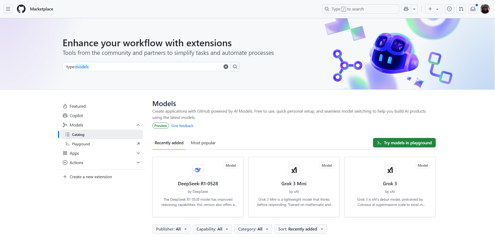
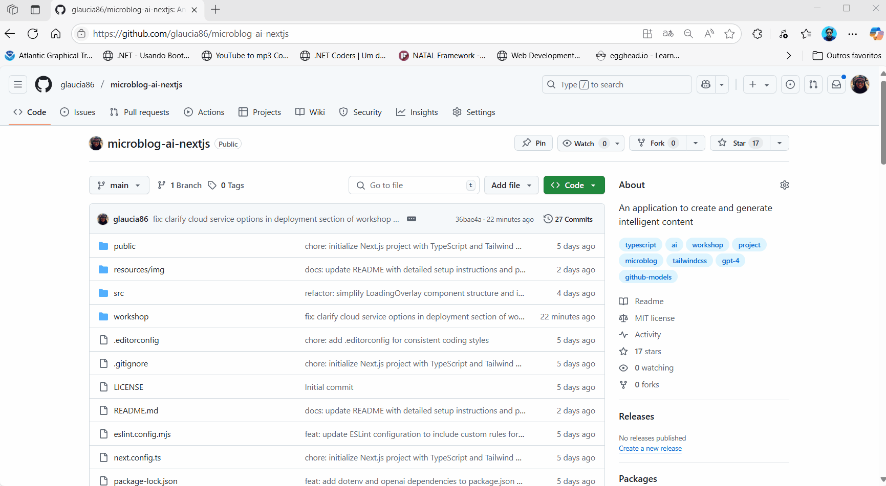

# Configuração do Ambiente de Desenvolvimento & GitHub Models

Antes de iniciar o desenvolvimento da aplicação, é essencial garantir que todas as ferramentas necessárias estejam corretamente instaladas no seu computador. Este módulo irá guiá-lo passo a passo, desde a verificação das versões até a preparação opcional para deploy, criando uma base sólida para todo o projeto.

## 1. Instalação do Node.js

Abra o terminal e execute o seguinte comando para verificar se o Node.js está instalado:

```bash
node -v

npm -v
```

> **Nota:** Se não estiver instalado, você pode baixá-lo em [nodejs.org](https://nodejs.org/).

## 2. Obtendo acesso ao GitHub Models

No decorrer do desenvolvimento da aplicação utlizaremos o GitHub Models. Mas, deixando claro que ele será utilizado somente na etapa de desenvolvimento e não em produção. Mas, o que seria o GitHub Models?

### O que é GitHub Models?



O GitHub Models é uma suíte de ferramentas integrada ao GitHub, projetada para tornar o desenvolvimento com IA mais acessível, colaborativo e produtivo. Em vez de lidar com diversas plataformas e configurações complexas, o GitHub Models oferece um espaço único dentro do próprio GitHub, onde você pode experimentar, comparar, gerenciar e avaliar modelos de IA em escala de produção — tudo isso com a segurança e a integração dos fluxos já conhecidos de projetos no GitHub.

No contexto deste workshop, usaremos o GitHub Models como fonte de IA para gerar textos inteligentes no nosso microblog, conectando nossa aplicação diretamente à API gratuita dos modelos (como GPT-4o). Isso elimina a necessidade de cartão de crédito, custos de API ou infraestrutura adicional.

No Marketplace, você pode verificar a lista de modelos disponíveis, suas funcionalidades e como integrá-los em seus projetos. É uma ótima maneira de explorar as possibilidades que a IA pode trazer para suas aplicações.

## Principais Funcionalidades do GitHub Models

- **Catálogo de Modelos:** Explore e selecione entre diversos modelos de IA (OpenAI, modelos open-source, etc.), todos prontos para uso direto na plataforma.

- **Gestão de Prompts:** Crie, edite e armazene prompts (instruções para o modelo de IA) de maneira organizada, versionada e colaborativa através de arquivos .prompt.yml no seu repositório.

- **Comparação de Modelos:** Teste diferentes modelos ou ajustes de prompt lado a lado, com os mesmos dados de entrada, e compare os resultados para escolher a melhor abordagem.

- **Avaliação Quantitativa:** Use métricas como similaridade, relevância e groundedness para analisar e comparar as respostas dos modelos, auxiliando na escolha e evolução do prompt ideal para seu projeto.

- **Playground Interativo:** Experimente ideias de prompts em tempo real, visualizando respostas e ajustando parâmetros, tudo de forma visual e sem código.

- **Integração com Produção:** Salve configurações e utilize a mesma experiência tanto para prototipagem quanto para integração com aplicações reais, seja via SDK ou REST API.

## Por que usar o GitHub Models neste workshop?

A escolha do GitHub Models para este projeto se baseia em três pilares:

- 1. **Acessibilidade**: Qualquer pessoa com conta GitHub pode acessar modelos avançados (como GPT-4o) sem custos, sem precisar configurar infraestrutura própria ou fornecer cartão de crédito.

- 2. **Facilidade de Integração**: A plataforma oferece uma API amigável, pronta para conectar diretamente ao nosso backend em Next.js.

- 3. **Experiência Profissional**: Ao usar o GitHub Models, você adota práticas semelhantes às de grandes equipes de IA, gerenciando, avaliando e iterando sobre modelos e prompts como no mundo real de produção.

## Como Habilitar e usar o GitHub Models no seu projeto

- **1. No GitHub (Pessoal):**
Basta acessar um repositório (pode ser novo ou já existente), ir nas configurações do repositório, encontrar a opção Models na barra lateral e habilitar o recurso.

Veja como fazer isso no gif abaixo:



- **2. Em Organizações/Empresas:**
É preciso que um proprietário da organização ative o GitHub Models para todos os repositórios autorizados.

> **Nota:** no decorrer do desenvolvimento da aplicação precisaremos gerar um token, que será utilizado para autenticar nossas requisições à API do GitHub Models. Quando estivermos nessa fase do workshop ensinaremos como fazer isso.

E, pronto! É o que precisamos para começar a desenvolver a nossa aplicação! Vamos criar agora o esqueleto da nossa aplicação.

**[⬅️ Back: Introdução](./01-introduction.md) | [Next: Criando o Projeto Base do Microblog A.I com Next.js ➡️](./03-initial-project-nextjs.md)**