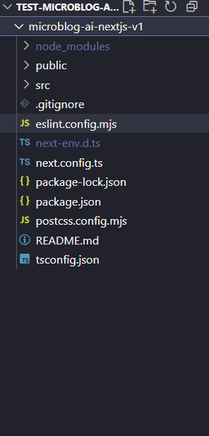

# Criando o Projeto Base do Microblog A.I com Next.js

Nesta seção, vamos criar nosso projeto do zero, entendendo cada decisão e comando. Vamos criar a base do nosso microblog utilizando Next.js e instalar as dependências necessárias.

## Começando nossa Jornada

Imagine que você acabou de receber um novo projeto para desenvolver um microblog utilizando inteligência artificial. A primeira coisa que precisaremos fazer é preparar o espaço de trabalho. Abra o seu terminal e navegue até onde você guarda seus projetos.

```bash
cd ~/projetos
```

Se não tem uma pasta de projetos, agora é um bom momento para criar uma:

```bash
mkdir -p ~/projetos
cd ~/projetos
```

## Criando o projeto com Next.js


O **[Next.js](https://nextjs.org/)** é um framework React que permite a criação de aplicações web de forma fácil e rápida. Ele oferece recursos como renderização do lado do servidor, geração de sites estáticos e muito mais. Para criar nosso projeto, vamos utilizar o comando `npx create-next-app` para inicializar um novo projeto Next.js.

```bash
npx create-next-app@latest microblog-ai-nextjs
```

Quando você executar este comando, o terminal vai fazer várias perguntas. Cada uma delas é importante para definir como nosso projeto será estruturado. Vamos entender cada escolha:

- **Would you like to use TypeScript? (YES):** TypeScript nos ajuda a escrever código mais seguro. Pois ajuda a previnir erros que só apareciam quando o usuário estivesse usando a aplicação.

- **Would you like to use ESLint? (YES):** ESLint é como ter um revisor de código automático. Ele verifica se estamos seguindo as boas práticas e nos avisa sobre possíveis problemas.

- **Would you like to use Tailwind CSS? (YES):** Tailwind CSS é uma biblioteca de estilos que nos ajuda a criar interfaces bonitas e responsivas de forma rápida e fácil.

- **Would you like your code inside a src/ directory? (YES):** Isso ajuda a manter a estrutura do projeto organizada, separando o código-fonte dos arquivos de configuração.

- **Would you like to use App Router? (YES):** O App Router é uma nova forma de gerenciar rotas no Next.js, tornando a navegação mais fácil e intuitiva.

- **Would you like to use Turbopack for next dev? (NO):** Turbopack é uma nova ferramenta de empacotamento que promete ser mais rápida que o Webpack, mas ainda está em desenvolvimento e pode não ser estável. Assim sendo, vamos usar as ferramentas estáveis e testadas.

- **Would you like to customize the import alias? (NO):** O alias padrão `@/*` já é perfeito para nosso projeto. Ele nos permite importar arquivos usando @/components/Button em vez de `../../../components/Button`. É um atalho que torna nosso código mais limpo

No final, as escolhas deverão corresponder conforme a imagem abaixo:


## Estrutura do Projeto 

Agora, vamos navegar até a pasta do projeto:

```bash
cd microblog-ai-nextjs
```

Abra o projeto no Visual Studio Code

```bash
code .
```

Quando você abrir o projeto, verá a estrutura de pastas e arquivos que o Next.js criou para nós. A partir daqui, podemos começar a desenvolver nosso microblog utilizando as melhores práticas e ferramentas disponíveis.



## Instalando dependências essenciais 

O projeto precisa de algumas ferramentas adicionais para funcionar corretamente. Vamos instalar as seguintes dependências:

* Dependencies: 

```bash
npm install @heroicons/react dotenv openai
```

Por que cada uma?

- `@heroicons/react`: Esta biblioteca fornece ícones prontos para uso que se encaixam perfeitamente com o Tailwind CSS, facilitando a adição de ícones ao nosso projeto.

- `dotenv`: Esta biblioteca é usada para carregar variáveis de ambiente a partir de um arquivo .env, permitindo que mantenhamos informações sensíveis, como chaves de API, fora do código-fonte. E, precisaremos dela para armazenar nossa chave da API da OpenAI que será gerada pelo GitHub Models.

- `openai`: Esta é a biblioteca oficial da OpenAI, que nos permite interagir com a API da OpenAI e utilizar seus modelos de linguagem em nosso projeto.

## Configurando o ambiente

Crie um arquivo `.env` na raiz do projeto e adicione sua chave da API da OpenAI:

```bash
touch .env
```

E, nesse arquivo `.env`, adicione a seguinte linha:

```bash
NEXT_PUBLIC_GITHUB_MODELS_TOKEN=""
NEXT_PUBLIC_GITHUB_MODELS_ENDPOINT=https://models.inference.ai.azure.com
```

Deixe o TOKEN vazio por enquanto. Vamos preenchê-lo mais tarde quando obtivermos acesso ao GitHub Models.

Agora uma pequena modificação! Abre o arquivo `eslint.config.mjs` e adicione a seguinte configuração:

```javascript
import { dirname } from "path";
import { fileURLToPath } from "url";
import { FlatCompat } from "@eslint/eslintrc";

const __filename = fileURLToPath(import.meta.url);
const __dirname = dirname(__filename);

const compat = new FlatCompat({
  baseDirectory: __dirname,
});

const eslintConfig = [
  ...compat.config({
    extends: ["next/core-web-vitals", "next/typescript"],
    rules: {
      '@typescript-eslint/no-explicit-any': 'off',
      '@typescript-eslint/no-unused-vars': 'off'
    }
  })
  //...compat.extends("next/core-web-vitals", "next/typescript"),
];

export default eslintConfig;
```

## Limpando o Projeto Inicial

O Next.js cria alguns arquivos de exemplo que não precisamos. Vamos fazer uma limpeza consciente.

Primeiro, vamos remover os arquivos desnecessários

```bash
rm -rf src/app/favicon.ico
```

Agora vamos modificar o projeto! Já crie a seguinte estrutura de pastas:

```md
- src:
  - app:
    - api
      - generate
        - route.ts
    - components
      - CharacterCounter.tsx
      - CTAButton.tsx
      - EnhancedTextInput.tsx
      - LoadingOverlay.tsx
      - PreviewCard.tsx
      - SuccessNotification.tsx
      - ToneSelector.tsx
    - generate
      - page.tsx
  - lib
    - services
      - github-models.services.ts
  - types
    - index.ts
```

Caso fique a dúvida, basta verificar a imagem de estrutura de pastas.


## Alterando o arquivo `globals.css`

Vamos adicionar algumas configurações globais de estilo no arquivo `globals.css` para garantir que nosso aplicativo tenha uma aparência consistente.

Faça as seguintes alterações no arquivo `globals.css`:

<details><summary><b>src/app/globals.css</b></summary>
<br/>

```css
@import "tailwindcss";

:root {
  --background: #ffffff;
  --foreground: #171717;
}

@theme inline {
  --color-background: var(--background);
  --color-foreground: var(--foreground);
  --font-sans: Inter, ui-sans-serif, system-ui, sans-serif;
  --font-mono: var(--font-geist-mono);
}

@media (prefers-color-scheme: dark) {
  :root {
    --background: #0a0a0a;
    --foreground: #ededed;
  }
}

body {
  background: var(--background);
  color: var(--foreground);
  font-family: var(--font-sans);
}

@keyframes slide-up {
  from {
    transform: translateY(100%);
    opacity: 0;
  }
  to {
    transform: translateY(0);
    opacity: 1;
  }
}

.animate-slide-up {
  animation: slide-up 0.3s ease-out;
}

.backdrop-blur-xs {
  backdrop-filter: blur(2px);
}

```

</details>
<br/>

Este CSS define apenas o essencial: cores base e fonte. O Tailwind cuidará do resto! 

## Criando nossa primeira página

Abra o arquivo `src/app/page.tsx` e vamos fazer algumas modificações para deixar a página inicial mais interessante. Delete tudo e escreva:

<details><summary><b>src/app/globals.css</b></summary>
<br/>

```tsx
export default function Home() {
  return (
    <main className="flex min-h-screen flex-col items-center justify-between p-24">
      <h1 className="text-4xl font-bold">
        Microblog AI Generator
      </h1>
    </main>
  )
}
```

</details>
<br/>

Vamos testar e verificar se tudo está funcionando. Vá até o terminal e execute o seguinte comando:

```bash
npm run dev
```

Abra seu navegador em http://localhost:3000. Você deve ver "Microblog AI Generator" centralizado na tela.

Se você ver isso, parabéns! você tem uma aplicação Next.js funcionando perfeitamente!


## Próximos Passos

Bom, na próxima sessão já começaremos a desenvolver ainda mais a aplicação e os seus componentes, que serão extremamente importantes para a funcionalidade do nosso gerador de microblogs. Nos vemos!

**[⬅️ Back: Configuração do Ambiente de Desenvolvimento & GitHub Models](./02-configure-environment-gh-models.md) | [Next: Sessão 03 ➡️](./04-session.md)**