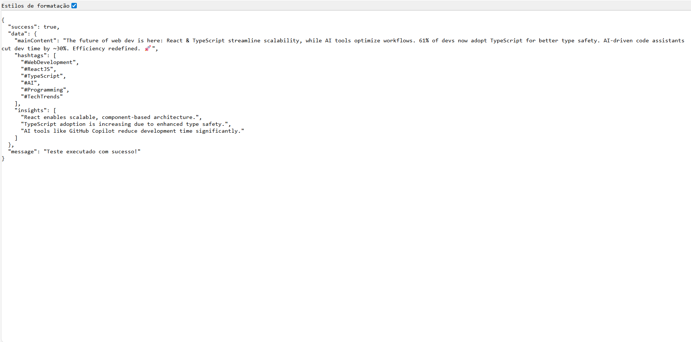

# Integração com a Inteligencia Artificial e GitHub Models

Chegamos ao coração da nossa aplicação: a integração com a Inteligência Artificial e os modelos do GitHub. Nesta seção, implementaremos a integração com **GitHub Models**, um serviço que nos dá acesso a modelos de IA de última geração e de graça. Desenvolveremos um serviço robusto que não apenas se comunica com a IA, mas também trata erros, implementa retry logic e valida respostas de forma profissional.

## Objetivos de Aprendizado

Ao final desta sessão, você será capaz de:

- Integrar APIs de IA em aplicações Next.js
- Implementar padrões de retry e tratamento de erros
- Criar prompts eficazes para diferentes contextos
- Validar e sanitizar respostas de IA
- Aplicar padrões de design como Singleton para otimizar performance.

## Passo 1: Entendendo o GitHub Models e Configuração Inicial

O **[GitHub Models](https://github.com/marketplace/models-github)** é uma plataforma que oferece acesso a modelos de IA avançados através de uma API compatível com OpenAI. Isso significa que podemos usar modelos como GPT-4o de forma escalável e confiável, aproveitando toda a infraestrutura do GitHub para hospedar nossa inteligência artificial.

A grande vantagem do GitHub Models é que ele nos permite experimentar com diferentes modelos de IA sem precisar gerenciar nossa própria infraestrutura. Além disso, a compatibilidade com a API da OpenAI significa que nosso código será facilmente portável caso decidamos migrar para outros provedores no futuro. E, claro, é gratuito para uso em projetos de código aberto, o que se alinha perfeitamente com nossa filosofia de desenvolvimento.

### Estruturando o Serviço Base

Vamos criar o arquivo `src/lib/services/github-models.service.ts` que será o centro de nossa integração com a IA.

<details><summary><b>src/lib/services/github-models.service.ts</b></summary>
<br/>

```typescript
// src/lib/services/github-models.service.ts
import { OpenAI } from "openai";
import "dotenv/config";
import { GeneratedContent } from "@/types";

// Interface para definir guidelines de tom de voz
interface ToneGuidelines {
  [key: string]: string[];
}

class GitHubModelsService {
  private client: OpenAI;
  private readonly toneGuidelines: ToneGuidelines;
  private readonly modelName: string = "gpt-4o";

  constructor() {
    // Validação de variáveis de ambiente no momento da instanciação
    this.validateEnvironmentVariables();

    // Configuração do cliente OpenAI para GitHub Models
    this.client = new OpenAI({
      baseURL: process.env.NEXT_PUBLIC_GITHUB_MODELS_ENDPOINT || "https://models.inference.ai.azure.com",
      apiKey: process.env.NEXT_PUBLIC_GITHUB_MODELS_TOKEN
    });

    // Inicialização das guidelines de tom de voz
    this.toneGuidelines = this.getToneGuidelines();  
  }

```

</details>
<br/>

### Analisando a Estrutura Base

Começamos com importações estratégicas que nos dão acesso ao SDK da OpenAI para comunicação com APIs compatíveis, ao dotenv para carregar variáveis de ambiente automaticamente, e ao nosso tipo personalizado `GeneratedContent` definido anteriormente.

A interface `ToneGuidelines` utiliza uma index signature que permite qualquer string como chave, com cada tom tendo múltiplas diretrizes armazenadas em um array de strings. Esta estrutura nos dá flexibilidade para adicionar novos tons no futuro sem quebrar o código existente.

A classe `GitHubModelsService` é onde encapsulamos toda a lógica de interação com o GitHub Models. No construtor, validamos as variáveis de ambiente essenciais para garantir que nossa aplicação não falhe silenciosamente em produção. A configuração do cliente OpenAI é feita com a base URL do GitHub Models e o token de autenticação, ambos definidos através de variáveis de ambiente.

A configuração do cliente é onde a mágica acontece. Redirecionamos a base URL para GitHub Models em vez da OpenAI oficial, incluímos um fallback com URL padrão caso a variável de ambiente não esteja definida, e configuramos a autenticação com o token específico do GitHub Models.

## Passo 2: Implementando Validação Robusta de Ambiente

### Criando um Sistema de validação proativo

Vamos implementar um método que valida as variáveis de ambiente necessárias para o funcionamento do serviço. Isso nos ajuda a evitar erros silenciosos em produção.

<details><summary><b>src/lib/services/github-models.service.ts (continuação)</b></summary>
<br/>

```typescript
private validateEnvironmentVariables() {
  const requiredVars = ['GITHUB_MODELS_TOKEN'];
  const missingVars = requiredVars.filter(varName => !process.env[varName]);

  if (missingVars.length > 0) {
    throw new Error(`Missing required environment variables: ${missingVars.join(', ')}`);
  }
}
```
</details>
<br/>

### Por que esta validação é fundamental?

Esta validação segue o **Fail Fast Principle**, detectando problemas de configuração imediatamente ao invés de esperar que erros difusos apareçam durante a execução. Isso facilita enormemente o debugging em diferentes ambientes de desenvolvimento e produção. Além disso, a validação de variáveis de ambiente é uma prática recomendada em aplicações modernas, especialmente quando lidamos com serviços externos que exigem autenticação. Ao garantir que todas as variáveis necessárias estejam presentes antes de inicializar o serviço, evitamos falhas inesperadas e melhoramos a confiabilidade da aplicação.

As mensagens de erro são intencionalmente claras e específicas, listando exatamente quais variáveis estão faltando. Isso acelera significativamente a resolução de problemas durante o deploy e melhora a experiência de desenvolvimento para toda a equipe.

Em termos de robustez em produção, esta validação previne tentativas de API calls sem autenticação adequada, evita vazamento de informações de erro sensíveis, e garante que a configuração esteja correta antes mesmo de inicializar o serviço.

### Configurando o Sistema de Guidelines de Tom de Voz

Agora, vamos implementar o método que retorna as diretrizes de tom de voz. Este método será usado para personalizar as respostas da IA de acordo com o contexto da aplicação.

<details><summary><b>src/lib/services/github-models.service.ts (continuação)</b></summary>
<br/>

```typescript
private getToneGuidelines(): ToneGuidelines {
  return {
    technical: [
      'Use precise technical language',
      'Include specific data points and statistics',
      'Maintain professional credibility',
      'Focus on accuracy and clarity',
      'Use industry-standard terminology',
    ],
    casual: [
      'Use conversational, friendly language',
      'Include relatable examples',
      'Keep the tone light and engaging',
      'Write as if talking to a friend',
      'Use everyday language and expressions',
    ],
    motivational: [
      'Use inspiring and empowering language',
      'Focus on positive outcomes and possibilities',
      'Include clear calls-to-action',
      'Create emotional connections',
      'Emphasize growth and achievement',
    ],
  };
}
```

</details>
<br/>

### Entendendo o design de guidelines eficazes

O tom **técnico** é construído ao redor de precisão e credibilidade profissional. Orientamos a IA para usar linguagem técnica precisa, incluir pontos de dados específicos e estatísticas, manter credibilidade profissional, focar em precisão e clareza, além de utilizar terminologia padrão da indústria.

Para o tom **casual**, criamos uma atmosfera conversacional e amigável. As diretrizes incluem usar linguagem conversacional e amigável, incluir exemplos relacionáveis, manter o tom leve e envolvente, escrever como se estivesse falando com um amigo, e usar linguagem e expressões do dia a dia.

O tom **motivacional** é projetado para inspirar e conectar emocionalmente. As orientações incluem usar linguagem inspiradora e empoderadora, focar em resultados positivos e possibilidades, incluir chamadas claras para ação, criar conexões emocionais, e enfatizar crescimento e conquistas.

## Passo 3: Desenvolvendo o Motor de Geração de Conteúdo

### Implementando o método principal de geração de conteúdo

Vamos implementar o método `generateMicroblogContent`, que será responsável por gerar conteúdo com base em um prompt e um tom de voz específico. Este método utilizará o cliente OpenAI para fazer chamadas à API do GitHub Models.

<details><summary><b>src/lib/services/github-models.service.ts (continuação)</b></summary>
<br/>

```typescript
async generateMicroblogContent(
  topic: string,
  tone: string,
  keywords?: string
): Promise<GeneratedContent> {
  return this.executeWithRetry(async () => {
    const systemMessage = this.createSystemPrompt();
    const userMessage = this.createUserPrompt(topic, tone, keywords);

    const completion = await this.client.chat.completions.create({
      model: 'gpt-4o',
      messages: [
        { role: 'system', content: systemMessage },
        { role: 'user', content: userMessage }
      ],
      temperature: 0.7,
      max_completion_tokens: 500,
      response_format: { type: 'json_object'},
    });

    const content = completion.choices[0]?.message?.content;
    if (!content) {
      throw new Error('No content generated');
    }

    const parsedContent = JSON.parse(content) as GeneratedContent;
    this.validateGeneratedContent(parsedContent);

    return parsedContent;
  });
}
```

</details>
<br/>

### Compreendendo os parâmetros da API

A configuração do modelo é cuidadosamente otimizada para nossa aplicação. Utilizamos o GPT-4o que é especificamente otimizado para tarefas criativas e precisas. A **temperature** de 0.7 representa um equilíbrio perfeito entre criatividade e consistência - valores próximos de 0.0 são muito determinísticos, enquanto valores próximos de 1.0 são muito criativos e aleatórios. O valor 0.7 é considerado o "sweet spot" para conteúdo criativo mas ainda focado.

O **max_completion_tokens** de 500 tokens não apenas limita nossos custos, mas também garante que as respostas sejam concisas e diretas ao ponto. O parâmetro **response_format** configurado como 'json_object' força a IA a retornar uma resposta estruturada e parseável, eliminando a necessidade de processamento adicional de texto.

O sistema de mensagens é estruturado com separação clara de responsabilidades. A **System Message** define a personalidade e regras gerais da IA, estabelecendo o contexto de como ela deve se comportar. A **User Message** contém a instrução específica e o contexto da tarefa atual. Esta separação permite que tenhamos controle fino sobre o comportamento da IA.

### Criando Prompts Eficazes - System Prompt

Vamos criar o método `createSystemPrompt`, que define as regras e o tom de voz da IA. Este prompt será usado em todas as interações com o modelo.

<details><summary><b>src/lib/services/github-models.service.ts (continuação)</b></summary>
<br/>

```typescript
private createSystemPrompt(): string {
  return `You are a professional content creator specializing in creating engaging microblog posts.
  Your expertise includes:
  - Creating viral-worthy content under 280 characters
  - Understanding social media engagement patterns
  - Crafting content that drives discussion and shares
  - Adapting tone while maintaining authenticity
  - Selecting impactful and trending hashtags

  Always ensure your responses are:
  1. Concise and impactful
  2. Optimized for social sharing
  3. Properly formatted as JSON
  4. Relevant to the target audience
  5. Engaging and shareable`;
}
```

</details>
<br/>

### Estratégias por trás do System Prompt

O System Prompt é cuidadosamente construído para estabelecer uma **definição de papel** clara. Ao identificar a IA como um "professional content creator" estabelecemos expertise imediata, enquanto "_specializing in microblog posts_" define um foco muito específico que orienta todas as respostas.

A **lista de competências** funciona como um currículo da IA. Cada competência reforça uma habilidade específica necessária para nossa aplicação, criando uma expectativa de qualidade profissional que se reflete nos resultados.

As **regras de comportamento** são apresentadas em formato numerado porque é mais fácil para a IA seguir instruções estruturadas. O uso de "_Always ensure_" cria uma expectativa de consistência que se mantém através de todas as respostas.

### Desenvolvendo o User Prompt dinâmico

Vamos implementar o método `createUserPrompt`, que cria um prompt dinâmico com base no tópico, tom de voz e palavras-chave fornecidas. Este método será crucial para personalizar as respostas da IA.

<details><summary><b>src/lib/services/github-models.service.ts (continuação)</b></summary>
<br/>

```typescript
private createUserPrompt(topic: string, tone: string, keywords?: string): string {
  let prompt = `Create a microblog post about "${topic}`;

  if (keywords) {
    prompt += `, incorporating the following keywords: ${keywords}`;
  }

  const guidelines = this.toneGuidelines[tone] || this.toneGuidelines.casual;
  prompt += `\n\nTone requirements (${tone}):\n${guidelines.map(g => `- ${g}`).join('\n')}`;

  prompt += `\n\nFormat your response as JSON: {
    "mainContent": "your microblog post (max 280 characters)",
    "hashtags": ["relevant", "hashtags", "array"],
    "insights": ["key insights about the topic as array"]
  }`;

  return prompt;
}
```

</details>
<br/>

### Anatomia da estrutura do User Prompt

A **instrução principal** é deliberadamente clara e direta, usando aspas para preservar o contexto completo do tópico fornecido pelo usuário. Esta simplicidade inicial garante que a IA entenda exatamente o que precisa fazer.

A **incorporação condicional de keywords** adiciona palavras-chave apenas quando fornecidas pelo usuário. A vírgula conecta naturalmente com a instrução principal, mantendo o prompt fluido e natural de ler.

As **guidelines dinâmicas de tom** são onde nossa arquitetura realmente brilha. O sistema busca as guidelines específicas do tom solicitado, mas inclui um fallback inteligente para "casual" caso um tom inválido seja fornecido. A formatação em bullet points torna as instruções extremamente claras para a IA processar.

A **especificação de formato** é muito importante para o funcionamento da aplicação. Fornecemos um schema JSON explícito que previne erros de parsing, incluímos comentários inline que orientam o modelo sobre limites e expectativas, e estruturamos tudo para espelhar exatamente nossa interface TypeScript.

## Passo 4: Criando um Sistema de Validação Multicamadas

### Implementando validação rigorosa do conteúdo

Vamos implementar o método `validateGeneratedContent`, que valida a estrutura e o conteúdo gerado pela IA. Este método garantirá que as respostas estejam no formato correto e atendam aos critérios de qualidade.

<details><summary><b>src/lib/services/github-models.service.ts (continuação)</b></summary>
<br/>

```typescript
private validateGeneratedContent(content: GeneratedContent): void {
  const { mainContent, hashtags, insights } = content;

  if (!mainContent || typeof mainContent !== 'string') {
    throw new Error('Invalid mainContent');
  }

  if (mainContent.length > 280) {
    throw new Error('Content exceeds 280 characters');
  }

  if (!Array.isArray(hashtags) || hashtags.length === 0) {
    throw new Error('Invalid or empty hashtags');
  }

  if (!Array.isArray(insights) || insights.length === 0) {
    throw new Error('Invalid or empty insights');
  }
}
```

</details>
<br/>

### Entendendo as camadas de validação

A primeira camada realiza **validação de tipo e existência**. Verificamos não apenas se o conteúdo existe, mas também se é do tipo correto. O operador `||` é especialmente útil aqui porque captura todos os valores falsy como null, undefined, ou string vazia.

A segunda camada aplica **validação de regras de negócio**. O limite de 280 caracteres não é arbitrário - é específico para microblogs e garante compatibilidade com todas as principais plataformas de mídia social. Esta validação acontece no backend para garantir que mesmo que o frontend seja comprometido, as regras sejam respeitadas.

A terceira camada executa **validação de estrutura de arrays**. Utilizamos `Array.isArray()` que é mais seguro e confiável que `instanceof Array`, especialmente em ambientes com múltiplos contexts de execução. Além disso, verificamos se os arrays têm pelo menos um elemento, garantindo que nossa IA sempre forneça conteúdo útil.

### Desenvolvendo o sistema de retry com backoff

Vamos implementar o método `executeWithRetry`, que executa uma função com lógica de retry e backoff exponencial. Isso garantirá que nossa aplicação seja resiliente a falhas temporárias da API.

<details><summary><b>src/lib/services/github-models.service.ts (continuação)</b></summary>
<br/>

```typescript
private async executeWithRetry<T>(
  operation: () => Promise<T>,
  maxAttempts: number = 3,
  delayMs: number = 1000
): Promise<T> {
  let lastError: Error | undefined;
  
  for (let attempt = 1; attempt <= maxAttempts; attempt++) {
    try {
      return await operation();
    } catch (error) {
      lastError = error as Error;
      console.warn(`Attempt ${attempt} failed:`, error);
      
      if (attempt < maxAttempts) {
        await new Promise(resolve => setTimeout(resolve, delayMs * attempt));
      }
    }
  }
  
  throw lastError;
}
```

</details>
<br/>

### Analisando o padrão retry avançado

O sistema utiliza **Generic Type Safety** através do `<T>` que permite retry de qualquer tipo de operação mantendo type safety completa através de toda a cadeia de execução. A assinatura `() => Promise<T>` define exatamente como as operações devem ser estruturadas.

Implementamos **Exponential Backoff** onde o primeiro attempt tem delay de 1000ms, o segundo de 2000ms, e o terceiro de 3000ms. Esta progressão reduz significativamente a carga em APIs que estão enfrentando problemas temporários, permitindo que elas se recuperem.

O sistema de **Error Aggregation** preserva o último erro para debugging detalhado. Utilizamos type assertion `as Error` para manter consistency, e fazemos `throw` do último erro apenas se todos os attempts falharem, fornecendo contexto completo sobre o que deu errado.

O **Logging Inteligente** usa nível `warn` porque indica um problema que não é crítico (ainda temos attempts restantes). Incluímos o número do attempt para facilitar debugging e fazemos log apenas em caso de falha, mantendo os logs limpos quando tudo funciona corretamente.

## Passo 5: Implementando o Padrão Singleton para Performance

## Criando o sistema Singleton

Vamos implementar o padrão Singleton para garantir que nossa instância do `GitHubModelsService` seja reutilizada em toda a aplicação, otimizando o uso de recursos e evitando múltiplas conexões desnecessárias.

<details><summary><b>src/lib/services/github-models.service.ts (continuação)</b></summary>
<br/>

```typescript
let serviceInstance: GitHubModelsService | null = null;

export function getGitHubModelsService(): GitHubModelsService {
  if(!serviceInstance) {
    serviceInstance = new GitHubModelsService();
  }

  return serviceInstance;
}
```

</details>
<br/>

### Vantagens de arquiteturiais do Singleton

O padrão Singleton nos oferece **reutilização de conexões** onde o cliente HTTP pode reutilizar connection pools, reduzindo significativamente o overhead de criação de instâncias e melhorando a performance em aplicações com muitas requests simultâneas.

Conseguimos **gestão de estado centralizada** com uma única fonte de configuração para toda a aplicação. As guidelines de tom são carregadas apenas uma vez na memória, e mantemos consistência através de toda a aplicação sem duplicação de recursos.

O **controle de recursos** evita múltiplas instâncias desnecessárias que consumiriam memória adicional, reduz o uso geral de memória da aplicação, e facilita debugging e monitoring porque temos apenas uma instância para rastrear.

A **Lazy Initialization** cria a instância apenas quando realmente necessária, faz a validação de ambiente sob demanda, e torna o startup da aplicação mais rápido porque não inicializamos serviços que podem nunca ser usados.

### Como utilizar na prática?

Para utilizar o serviço Singleton em sua aplicação, basta importar a função `getGitHubModelsService` e chamar o método `generateMicroblogContent` conforme necessário. Veja um exemplo de uso:

```typescript
// Em uma API route ou component
import { getGitHubModelsService } from '@/lib/services/github-models.service';

// Exemplo de uso
const service = getGitHubModelsService();
const content = await service.generateMicroblogContent(
  "Machine Learning trends",
  "technical",
  "AI, neural networks, deep learning"
);
```

## Passo 6 Configurando Variáveis de Ambiente de Forma Segura

### Configuração local de desenvolvimento

Crie o arquivo `.env` na raiz do projeto com suas credenciais do GitHub Models:

```bash
# GitHub Models Configuration
NEXT_PUBLIC_GITHUB_MODELS_TOKEN=your_github_models_token_here
NEXT_PUBLIC_GITHUB_MODELS_ENDPOINT=https://models.inference.ai.azure.com
```

### Configuração para produção no vercel

Para deploy em produção, configure as variáveis de ambiente através do painel do Vercel. Acesse Dashboard Vercel, navegue até seu projeto, vá em Settings e depois Environment Variables. Adicione `NEXT_PUBLIC_GITHUB_MODELS_TOKEN` com seu token do GitHub Models e `NEXT_PUBLIC_GITHUB_MODELS_ENDPOINT` com a URL do endpoint.

### Implementando boas práticas de segurança

É muito importante que nunca envie secrets para o repositório. Nosso arquivo `.gitignore` já está configurado para excluir `.env*.local` e `.env`, garantindo que credenciais nunca sejam expostas acidentalmente.

Nossa validação em runtime através do método `validateEnvironmentVariables()` garante configuração correta e implementa falha rápida em caso de configuração incorreta, prevenindo problemas silenciosos em produção. Para diferentes ambientes, recomendamos usar tokens específicos para desenvolvimento e produção, permitindo maior controle de acesso e melhor tracking de uso por ambiente.

## Passo 7: Testando e validando o serviço

### Criando um teste manual básico

Para validar nosso serviço, vamos criar um teste manual simples. Crie um arquivo `src/app/api/test-ai/route.ts` para expor uma rota de testes. Esse arquivo é apenas para fins de desenvolvimento e não devem ser incluído no repositório final.

<details><summary><b>src/app/api/test-ai/route.ts</b></summary>
<br/>

```typescript
// src/app/api/test-ai/route.ts
import { getGitHubModelsService } from '@/lib/services/github-models.services';
import { NextResponse } from 'next/server';

export async function GET() {
  try {
    console.log('🧪 Iniciando teste do GitHub Models Service...');
    
    const service = getGitHubModelsService();
    
    const result = await service.generateMicroblogContent(
      "The future of web development",
      "technical",
      "React, TypeScript, AI"
    );
    
    console.log('✅ Teste bem-sucedido:', result);
    
    return NextResponse.json({
      success: true,
      data: result,
      message: 'Teste executado com sucesso!'
    });
    
  } catch (error) {
    console.error('❌ Teste falhou:', error);
    
    return NextResponse.json({
      success: false,
      error: error instanceof Error ? error.message : 'Erro desconhecido',
      message: 'Teste falhou'
    }, { status: 500 });
  }
}
```

</details>
<br/>

Agora, abre o terminal e execute o comando:

```bash
npm run dev
```

Acesse a rota de teste em `http://localhost:3000/api/test-ai` e verifique se o serviço está funcionando corretamente. Você deve ver a resposta JSON com o conteúdo gerado pela IA.

Se você ver a mensagem de sucesso e o conteúdo gerado, parabéns! Você integrou com sucesso o GitHub Models em sua aplicação Next.js.

```json
{
  "success": true,
  "data": {
    "mainContent": "🚀 The future of web development is here! React + TypeScript + AI integration is revolutionizing how we build applications. Smart auto-completion, predictive UIs, and intelligent debugging are becoming standard. #WebDev #AI #React #TypeScript",
    "hashtags": ["WebDev", "AI", "React", "TypeScript", "FutureOfTech", "JavaScript"],
    "insights": [
      "AI-powered development tools are reducing coding time by 40%",
      "TypeScript adoption has increased 300% in the past 2 years",
      "React remains the most popular frontend framework in 2024",
      "Integration of AI in development workflows is becoming essential"
    ]
  },
  "message": "Teste executado com sucesso!"
}
```

Nos logs do console, você deve ver algo como:

```
🧪 Iniciando teste do GitHub Models Service...
✅ Teste bem-sucedido: {
  mainContent: "🚀 The future of web development is here!...",
  hashtags: ["WebDev", "AI", "React", "TypeScript", "FutureOfTech", "JavaScript"],
  insights: [...]
}
```

E, no navegador, você verá a resposta JSON formatada com o conteúdo gerado pela IA.



E se você encontrar algum erro, verifique os logs no console para entender o que deu errado. A mensagem de erro deve ser clara e informativa, ajudando você a identificar o problema rapidamente.

## Exercícios práticos para consolidação

### Expandindo com novo tom de voz

Implemente um tom **"professional"** adicionando às guidelines existentes. Este tom deve usar linguagem formal de negócios, focar em tendências e insights da indústria, manter tom autoritativo, incluir métricas relevantes quando possível, e abordar pontos de dor e soluções.

Teste o novo tom criando uma nova API route ou modificando a existente para incluir este novo tom de voz.

### Implementando Cache Simples

Implemente um sistema de logging de métricas que rastreie total de requests, requests bem-sucedidas, requests que falharam, e tempo médio de resposta. Isso ajudará no monitoring da aplicação em produção.

Crie uma API route adicional em `/api/test-ai/metrics` que retorne essas estatísticas.

### Validação Customizada Avançada

Implemente validação mais rigorosa para hashtags, verificando formato, caracteres permitidos, e comprimento máximo. Isso garantirá que todas as hashtags geradas sejam válidas para plataformas de mídia social.

Teste a validação criando cenários que forcem a IA a gerar hashtags inválidas e observe como o sistema responde.

## Resumo da Sessão e Próximos Passos

### O que Conquistamos?

Nesta sessão, implementamos um serviço robusto de IA com integração completa ao GitHub Models. Criamos um sistema de prompts diferenciados por tom que permite flexibilidade total na geração de conteúdo. Implementamos validação rigorosa tanto de entrada quanto de saída, garantindo qualidade e consistência.

Desenvolvemos padrões de resilência com retry logic usando exponential backoff, tratamento abrangente de erros que previne falhas silenciosas, e validação proativa de variáveis de ambiente que detecta problemas de configuração imediatamente.

Nossa arquitetura é escalável graças ao padrão Singleton que otimiza performance, separação clara de responsabilidades que facilita manutenção, e interface completamente type-safe com TypeScript que previne erros em tempo de desenvolvimento.

Implementamos boas práticas de segurança com gestão segura de secrets, validação robusta de configuração, e error handling defensivo que protege contra vazamentos de informação.

Mais importante, criamos um sistema de testes prático e profissional usando API routes que simula exatamente como o serviço será usado em produção, fornece feedback imediato através de logs detalhados, e facilita debugging e desenvolvimento iterativo.

## Preparação para a Próxima Sessão

Na Sessão 6, criaremos a interface de usuário completa para o formulário de geração, desenvolveremos uma página dedicada que utiliza nossa API de teste como base, implementaremos sistema de loading states e feedback visual avançado, e finalizaremos a integração frontend-backend para uma experiência de usuário fluida e profissional.

Utilizaremos a API route de teste que criamos como foundation para a API de produção, expandindo-a com validação adicional, rate limiting, e outras funcionalidades necessárias para um ambiente de produção robusto.

> **Dica Profissional:** Sempre teste seus prompts com diferentes tipos de entrada para garantir robustez. A qualidade do prompt determina diretamente a qualidade da resposta da IA, então invista tempo experimentando e refinando suas instruções. O sistema de testes que implementamos torna essa experimentação rápida e eficiente, permitindo iteração rápida durante o desenvolvimento.

**[⬅️ Back: Estrutura base com Tipagem e Criando os primeiros Componentes Reutilizáveis](./04-initial-structure-components-ctabutton.md) | [Next: Integração com a API de Geração de Conteúdo ➡️](./06-integration-with-api-content-generated.md)**
