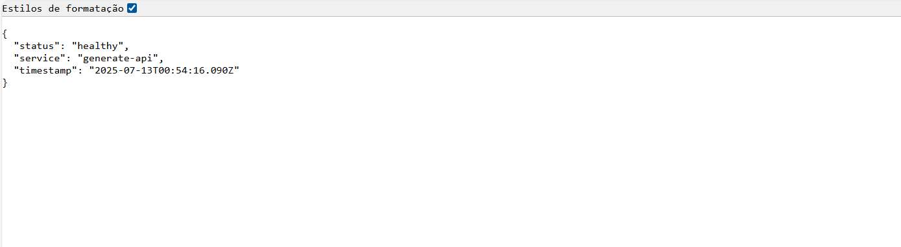
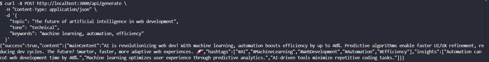
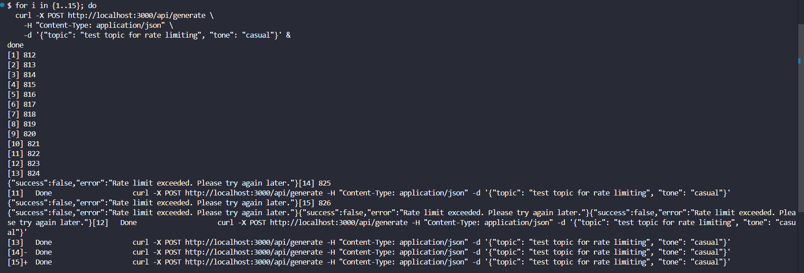
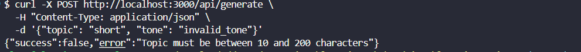
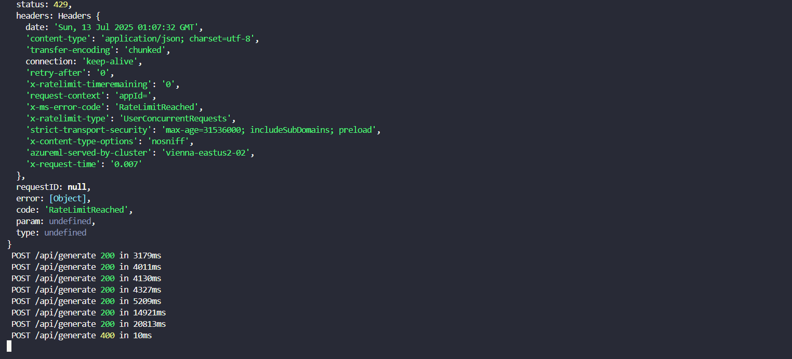

# Integração com a API de Geração de Conteúdo

Agora que temos nosso serviço de IA funcionando perfeitamente, é hora de criar uma API de produção robusta que possa lidar com tráfego real. Nesta sessão, desenvolveremos uma API route completa que inclui rate limiting, validação avançada, tratamento de erros sofisticado e otimizações de performance. Transformaremos nossa API de teste em um endpoint pronto para produção.

## Objetivos de Aprendizado

Ao final desta sessão, você será capaz de implementar rate limiting eficaz em aplicações Next.js, criar sistemas de validação multicamadas para APIs robustas, desenvolver tratamento de erros categorizado e informativo, otimizar headers HTTP para performance e cache, implementar health checks para monitoring de aplicação, e aplicar princípios de segurança em APIs públicas.

## Passo 1: Criando a estrutura da API de produção

### Evoluindo da API de Teste para Produção

Nossa API de teste funcionou perfeitamente para validar a integração, mas uma API de produção precisa de muito mais robustez. Vamos criar o arquivo `src/app/api/generate/route.ts` que será nosso endpoint principal para geração de conteúdo.

<details><summary><b>src/app/api/generate/route.ts</b></summary>
<br/>

```typescript
// src/app/api/generate/route.ts
import { NextRequest, NextResponse } from 'next/server';
import { getGitHubModelsService } from '../../../lib/services/github-models.services'
import type { GenerateApiRequest, GenerateApiResponse } from '@/types';
```

</details>
<br/>

### Entendendo as Importações Estratégicas
Neste trecho, importamos `NextRequest` e `NextResponse` do Next.js, que nos permitem manipular requisições e respostas HTTP de forma avançada. Também importamos nosso serviço GitHub Models, que encapsula toda a lógica de interação com a API de IA.

Começamos importando NextRequest e NextResponse que nos dão acesso completo às funcionalidades avançadas do Next.js para manipulação de requisições e respostas HTTP. Estas classes oferecem métodos mais sofisticados que os tradicionais Request e Response do Node.js.
O import do nosso serviço GitHub Models mantém a separação de responsabilidades clara. A API route é responsável apenas pela interface HTTP, enquanto toda a lógica de negócio permanece encapsulada no serviço.

Os tipos `GenerateApiRequest` e `GenerateApiResponse` que definimos anteriormente garantem type safety completo através de toda nossa API, prevenindo erros de runtime e melhorando a experiência de desenvolvimento.

## Passo 2: Implementando Rate Limiting Inteligente

### Configurando o sitema de rate limiting

Para evitar abusos e garantir que nossa API possa lidar com tráfego real, implementaremos rate limiting. 

<details><summary><b>src/app/api/generate/route.ts (continuação)</b></summary>
<br/>

```typescript
// Rate limiting configuration
const RATE_LIMIT_WINDOW = 60 * 1000; // 1 minute
const MAX_REQUESTS_PER_WINDOW = 10;
const requestCounts = new Map<string, { count: number; resetTime: number }>();
```

</details>
<br/>

### Entendendo a Arquitetura do Rate Limiting

O rate limiting é fundamental para proteger nossa API contra abuso e garantir que recursos sejam distribuídos de forma justa entre todos os usuários. Configuramos uma janela de tempo de 60 segundos com limite máximo de 10 requisições por cliente.

Utilizamos um Map em memória para armazenar contadores por cliente. Cada entrada contém o número atual de requisições e o timestamp de quando o contador deve ser resetado. Esta abordagem é eficiente para aplicações de médio porte e não requer infraestrutura adicional como Redis.

A estrutura `{ count: number; resetTime: number }` nos permite implementar sliding window rate limiting de forma simples mas eficaz. O resetTime determina quando o contador volta a zero, criando janelas de tempo consistentes.

### Implementando a Lógica de Rate Limiting

<details><summary><b>src/app/api/generate/route.ts (continuação)</b></summary>
<br/>

```typescript
// Rate limiting implementation
function checkRateLimit(clientId: string): boolean {
  const now = Date.now();
  const clientData = requestCounts.get(clientId);
  
  if (!clientData || now > clientData.resetTime) {
    requestCounts.set(clientId, {
      count: 1,
      resetTime: now + RATE_LIMIT_WINDOW,
    });
    return true;
  }
  
  if (clientData.count >= MAX_REQUESTS_PER_WINDOW) {
    return false;
  }
  
  clientData.count += 1;
  return true;
}
```

</details>
<br/>

### Analisando a Lógica de Rate Limiting

A função `checkRateLimit` implementa uma estratégia elegante para controle de tráfego. Primeiro, verificamos se existe um registro para o cliente atual. Se não existe ou se a janela de tempo expirou, criamos um novo registro e permitimos a requisição.
Se o cliente já está dentro da janela de tempo, verificamos se ele atingiu o limite máximo de requisições. Se sim, bloqueamos a requisição retornando false. Caso contrário, incrementamos o contador e permitimos a requisição. Essa abordagem é eficiente e thread-safe para o contexto de uma única instância Node.js, garantindo que todas as operações de rate limiting tenham complexidade O(1).

A verificação `now > clientData.resetTime` garante que as janelas de tempo sejam respeitadas. Quando uma janela expira, o contador é automaticamente resetado, dando ao cliente uma nova janela para fazer requisições.

Esta implementação é thread-safe para o contexto de uma única instância Node.js e oferece performance excelente com complexidade O(1) para todas as operações.

## Passo 3: Desenvolvendo Validação Robusta de Entrada

### Criando o sistema de validação

<details><summary><b>src/app/api/generate/route.ts (continuação)</b></summary>
<br/>

```typescript
// Input validation
function validateRequest(body: any): GenerateApiRequest | null {
  const { topic, tone, keywords } = body;
  
  if (!topic || typeof topic !== 'string') {
    return null;
  }
  
  if (!tone || typeof tone !== 'string') {
    return null;
  }
  
  if (keywords !== undefined && typeof keywords !== 'string') {
    return null;
  }
  
  return { topic: topic.trim(), tone: tone.toLowerCase(), keywords: keywords?.trim() };
}
```

</details>
<br/>

### Entendendo os Princípios da Validação
Nossa função de validação implementa o princípio _"fail fast"_ combinado com sanitização automática de dados. Cada campo é verificado tanto para existência quanto para tipo correto, garantindo que dados inválidos sejam rejeitados imediatamente.

A validação do campo _topic_ verifica se existe e se é uma string não vazia. O operador `!topic` captura valores null, undefined, strings vazias, e outros valores falsy, proporcionando cobertura abrangente.

Para _keywords_, implementamos validação condicional. Se o campo está presente, deve ser uma string, mas sua ausência é perfeitamente aceitável. Isso oferece flexibilidade para o cliente da API sem comprometer a robustez.

A sanitização automática com `trim()` remove espaços em branco desnecessários, enquanto `toLowerCase()` normaliza o tom de voz. Estas transformações garantem consistência nos dados processados pelo nosso serviço de IA.

### Implementando Validações Avançadas

<details><summary><b>src/app/api/generate/route.ts (continuação)</b></summary>
<br/>

```typescript
// Additional validation
if (validatedData.topic.length < 10 || validatedData.topic.length > 280) {
  return NextResponse.json(
    { success: false, error: 'Topic must be between 10 and 280 characters' },
    { status: 400 }
  );
}

const validTones = ['technical', 'casual', 'motivational'];
if (!validTones.includes(validatedData.tone)) {
  return NextResponse.json(
    { success: false, error: 'Invalid tone of voice' },
    { status: 400 }
  );
}
```

</details>
<br/>

### Estratégia por Trás das Validações Avançadas

As validações de comprimento não são arbitrárias. O limite mínimo de 10 caracteres garante que temos contexto suficiente para a IA gerar conteúdo relevante. O limite máximo de 200 caracteres previne abuse e garante que o prompt resultante permaneça dentro de limites razoáveis.
A validação de tons utilizando uma whitelist é uma prática de segurança fundamental. Em vez de assumir que qualquer valor é válido, explicitamente definimos quais tons são aceitos. Isso previne injection attacks e garante que apenas tons com guidelines definidas sejam processados.

A resposta de erro é estruturada e consistente, sempre incluindo o campo success: false e uma mensagem de erro clara. O código de status HTTP 400 (Bad Request) comunica claramente que o problema está com os dados enviados pelo cliente.

## Passo 4: Construindo o Endpoint Principal

### Implementando a lógica principal da API

Agora que temos rate limiting e validação robusta, vamos implementar a lógica principal do endpoint.

<details><summary><b>src/app/api/generate/route.ts (continuação)</b></summary>
<br/>

```typescript
export async function POST(request: NextRequest) {
  try {
    // Extract client identifier (IP or session)
    const clientId = request.headers.get('x-forwarded-for') || 
                    request.headers.get('x-real-ip') || 
                    'anonymous';
    
    // Check rate limit
    if (!checkRateLimit(clientId)) {
      return NextResponse.json(
        { success: false, error: 'Rate limit exceeded. Please try again later.' },
        { status: 429 }
      );
    }
    
    // Parse and validate request body
    const body = await request.json();
    const validatedData = validateRequest(body);
    
    if (!validatedData) {
      return NextResponse.json(
        { success: false, error: 'Invalid request data' },
        { status: 400 }
      );
    }
```

</details>
<br/>

### Analisando a Identificação de Cliente

A identificação correta do cliente é crucial para rate limiting eficaz. Utilizamos uma estratégia em cascata que primeiro verifica headers de proxy como `x-forwarded-for`, depois `x-real-ip`, e finalmente fallback para `'anonymous'`.

Esta abordagem é importante porque em ambientes de produção, especialmente com CDNs como Cloudflare ou load balancers, o IP real do cliente pode estar em headers específicos. O fallback para `'anonymous'` garante que o sistema continue funcionando mesmo quando não conseguimos identificar o cliente específico.

A ordem dos headers é intencional. `x-forwarded-for` é o padrão mais comum para proxies HTTP, enquanto `x-real-ip` é usado por alguns load balancers. Esta flexibilidade garante compatibilidade com diferentes infraestruturas.

### Processando a geração de conteúdo

<details><summary><b>src/app/api/generate/route.ts (continuação)</b></summary>
<br/>

```typescript
// Generate content using the service
const service = getGitHubModelsService();
const generatedContent = await service.generateMicroblogContent(
  validatedData.topic,
  validatedData.tone,
  validatedData.keywords
);

// Return successful response
const response: GenerateApiResponse = {
  success: true,
  content: generatedContent,
};

return NextResponse.json(response, {
  status: 200,
  headers: {
    'Cache-Control': 'no-store, max-age=0',
    'Content-Type': 'application/json',
  },
});
```

</details>
<br/>

### Otimizando Headers de Resposta

Os headers de resposta são cuidadosamente configurados para otimizar performance e segurança. O header `Cache-Control: no-store, max-age=0` garante que conteúdo gerado pela IA nunca seja cacheado, pois cada geração deve ser única e contextual.

O `Content-Type: application/json` explicita o formato da resposta, ajudando clients a processar corretamente os dados retornados. Embora o Next.js configure isso automaticamente, explicitá-lo melhora a clareza e garante consistência.

A estrutura da resposta mantém o padrão estabelecido com `success: true` e o conteúdo no campo `content`. Esta consistência facilita o desenvolvimento frontend e reduz a possibilidade de erros de integração.

## Passo 5: Implementando Tratamento de Erros Avançado

### Criando um sistema de tratamento categorizado

Vamos agora implementar um sistema de tratamento de erros que categoriza diferentes tipos de falhas, desde erros de validação até problemas com a API externa.

<details><summary><b>src/app/api/generate/route.ts (continuação)</b></summary>
<br/>

```typescript
} catch (error) {
  console.error('Generation API error:', error);
  
  // Determine error type and status code
  let statusCode = 500;
  let errorMessage = 'An unexpected error occurred';
  
  if (error instanceof Error) {
    if (error.message.includes('environment variables')) {
      statusCode = 500;
      errorMessage = 'Server configuration error';
    } else if (error.message.includes('Rate limit exceeded')) {
      statusCode = 429;
      errorMessage = 'API rate limit exceeded';
    } else if (error.message.includes('Invalid')) {
      statusCode = 400;
      errorMessage = error.message;
    } else {
      errorMessage = 'Failed to generate content';
    }
  }
  
  return NextResponse.json(
    { success: false, error: errorMessage },
    { status: statusCode }
  );
}
```

</details>
<br/>

### Entendendo a Categorização de Erros

O sistema de tratamento de erros categoriza diferentes tipos de falha para fornecer respostas apropriadas. Erros de configuração de ambiente resultam em status 500 (Internal Server Error) porque representam problemas do servidor que o cliente não pode resolver.

Erros de rate limiting recebem status 429 (Too Many Requests), um código específico que permite que clients implementem backoff automático. Esta especificidade ajuda ferramentas de monitoramento a identificar diferentes tipos de problemas.

Erros de validação mantêm status 400 (Bad Request) e preservam a mensagem original quando possível. Isso fornece feedback específico para desenvolvedores que estão integrando com nossa API.

Para erros não categorizados, fornecemos uma mensagem genérica mas ainda útil. Isso evita vazamento de informações sensíveis enquanto mantém logs detalhados no servidor para debugging.

### Logging Estratégico para Debugging

O `console.error('Generation API error:', error)` garante que todos os erros sejam logados com contexto completo. Em produção, estes logs são essenciais para monitoramento e debugging de problemas intermitentes.

A estratégia de logging captura tanto erros esperados quanto inesperados, criando uma trilha de auditoria completa. Isso é fundamental para identificar padrões de falha e otimizar a robustez da aplicação.

## Passo 6: Adicionando Health Check para Monitoramento

### Implementando o endpoint de health check

Vamos agora adicionar um endpoint de health check que permitirá monitorar a saúde da nossa API e garantir que ela esteja sempre disponível.

<details><summary><b>src/app/api/health/route.ts</b></summary>
<br/>

```typescript
// Health check endpoint
export async function GET() {
  return NextResponse.json(
    { 
      status: 'healthy',
      service: 'generate-api',
      timestamp: new Date().toISOString(),
    },
    { status: 200 }
  );
}
```

</details>
<br/>

### Importância dos Health Checks

Health checks são fundamentais para operações de produção. Eles permitem que sistemas de monitoramento, load balancers e orquestradores como Kubernetes verifiquem se o serviço está respondendo corretamente.

O timestamp incluído na resposta ajuda a identificar se o serviço está realmente processando requisições ou apenas retornando uma resposta cacheada. Esta informação é valiosa para debugging de problemas de performance.
A identificação do serviço `('generate-api')` facilita o debugging em arquiteturas de microserviços onde múltiplos serviços podem ter endpoints de health check similares.

### Expandindo Health Checks para Validação Completa

Em implementações mais avançadas, o health check pode verificar a conectividade com o GitHub Models, validar variáveis de ambiente, e testar outros componentes críticos. Por enquanto, mantemos uma implementação simples mas funcional que pode ser expandida conforme necessário.

## Passo 7: Testando a API de Produção

### Criando Testes abrangentes

Agora que nossa API está completa, podemos testá-la de várias formas. A ferramenta mais simples é usar o próprio navegador para testar o health check:

```bash
curl -X GET http://localhost:3000/api/generate
```



Para testar a geração de conteúdo, podemos usar ferramentas como curl, Postman, ou criar uma interface web simples. Exemplo com curl (terminal via git bash): 

> não esqueça de executar o comando `npm run dev` para iniciar o servidor Next.js antes de testar a API. E depois abre um novo terminal para executar o comando curl.

```bash
curl -X POST http://localhost:3000/api/generate \
  -H "Content-Type: application/json" \
  -d '{
    "topic": "The future of artificial intelligence in web development",
    "tone": "technical",
    "keywords": "machine learning, automation, efficiency"
  }'
```

Se aparecer algo parecido com a imagem abaixo, significa que tudo está funcionando corretamente:



### Testando cenários de erro

É importante testar também os cenários de erro para garantir que nossa API responde adequadamente:

- **Teste de Rate Limiting:**

Execute múltiplas requisições rapidamente para verificar se o rate limiting está funcionando:

```bash
for i in {1..15}; do
  curl -X POST http://localhost:3000/api/generate \
    -H "Content-Type: application/json" \
    -d '{"topic": "test topic for rate limiting", "tone": "casual"}' &
done
```

Se tudo estiver correto você receberá uma resposta de erro 429 após as primeiras 10 requisições.



- **Teste de Validação:** Envie dados inválidos para verificar se a validação está capturando erros corretamente:

```bash
curl -X POST http://localhost:3000/api/generate \
  -H "Content-Type: application/json" \
  -d '{"topic": "short", "tone": "invalid_tone"}'
```

Se tudo estiver certo, você receberá mensagem de erro:



### Monitorando Performance

Durante os testes, observe os logs no terminal onde está executando npm run dev. Você verá informações valiosas sobre performance, erros, e comportamento do rate limiting.
Para testes mais avançados, considere usar ferramentas como Apache Bench (ab) ou Artillery para simular carga real e verificar como a API se comporta sob stress.



## Considerações de Segurança e Performance

### Estratégias de Segurança Implementadas

Nossa API implementa várias camadas de segurança. O rate limiting previne ataques de denial of service e uso abusivo de recursos. A validação rigorosa de entrada previne injection attacks e garante que apenas dados válidos sejam processados.

O tratamento cuidadoso de erros evita vazamento de informações sensíveis enquanto ainda fornece feedback útil para desenvolvedores legítimos. Os logs detalhados no servidor permitem investigação de problemas sem expor detalhes internos publicamente.

### Otimizações de Performance

O uso do padrão Singleton no serviço GitHub Models reutiliza conexões HTTP, reduzindo latência. O sistema de rate limiting em memória oferece performance excelente sem dependências externas.

Headers de cache apropriados garantem que conteúdo gerado pela IA não seja cacheado indevidamente, mantendo a unicidade de cada resposta. A validação early return garante que requisições inválidas sejam rejeitadas rapidamente sem consumir recursos desnecessários.

### Preparando para Escala

Embora nossa implementação atual seja adequada para aplicações de médio porte, em escala maior seria necessário considerar rate limiting distribuído usando Redis, logging estruturado para análise automatizada, métricas detalhadas para monitoramento de performance, e circuit breakers para resiliência contra falhas de serviços externos.

## Exercícios práticos avançados

### Implementando Métricas Detalhadas
Adicione um sistema de métricas que rastreie tempo de resposta, tipos de erro mais comuns, utilização de rate limiting, e temas mais populares solicitados. Crie um endpoint `/api/generate/metrics` que retorne essas estatísticas.

### Expandindo o Rate Limiting

Implemente rate limiting diferenciado por tipo de usuário. Por exemplo, usuários autenticados poderiam ter limites mais altos. Considere implementar rate limiting por endpoint além do rate limiting global.

### Adicionando Autenticação

Implemente um sistema de API keys que permita autenticação de usuários e rate limiting personalizado. Isso prepara a API para uso comercial ou por desenvolvedores externos.

### Melhorando Health Checks

Expanda o health check para verificar conectividade com GitHub Models, validar configurações críticas, e reportar métricas de performance básicas. Considere implementar diferentes níveis de health check (shallow vs deep).

## Resumo da Sessão e Próximos Passos

### O que Conquistamos?

Nesta sessão, criamos uma API de produção robusta que pode lidar com tráfego real. Implementamos rate limiting eficaz para proteger contra abuso, desenvolvemos sistema de validação multicamadas que garante qualidade dos dados, e criamos tratamento de erros categorizado que fornece feedback apropriado.

Nossa API agora inclui otimizações de performance através de headers apropriados e logging estratégico, health checks para monitoramento operacional, e múltiplas camadas de segurança para proteger contra ataques comuns.

A arquitetura é escalável e pode ser facilmente expandida com funcionalidades adicionais como autenticação, métricas avançadas, e rate limiting distribuído conforme a aplicação cresce.

### Preparação para a Próxima Sessão

Na Sessão 7, criaremos a interface de usuário completa que consome nossa API robusta. Desenvolveremos um formulário intuitivo com validação em tempo real, implementaremos estados de loading elegantes e feedback visual, e criaremos uma experiência de usuário fluida que demonstra todo o poder da nossa integração com IA.

Utilizaremos nossa API de produção como foundation, implementando tratamento de erros no frontend que corresponde às respostas da API, e criando uma aplicação completa que está pronta para deploy em produção.

> **Dica Profissional:** APIs robustas são a foundation de aplicações escaláveis. O tempo investido em validação, tratamento de erros, e otimizações de performance na camada de API se paga múltiplas vezes quando a aplicação cresce. Sempre pense em como suas decisões de design afetarão a manutenibilidade e escalabilidade a longo prazo.

**[⬅️ Back: Integração com a Inteligencia Artificial e GitHub Models](./05-initial-structure-components-ctabutton.md) | [Next: Sessão 07 ➡️](./07-session.md)**

