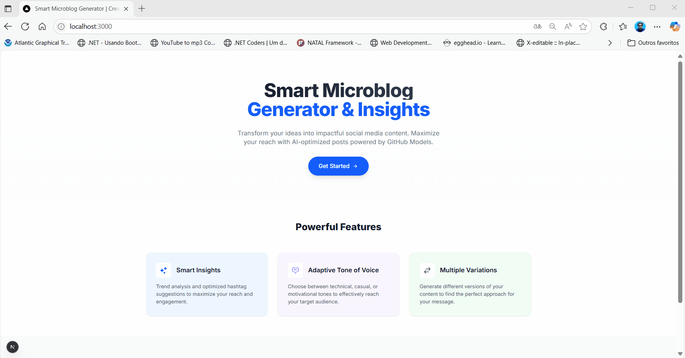

## Sessão 09: Conclusão e Próximos Passos

Nesta sessão final, celebraremos as conquistas obtidas durante a versão 1.0 do nosso projeto **Microblog AI com Next.js**. Ao longo dessa jornada, você aprendeu e aplicou técnicas avançadas que unem JavaScript/TypeScript, React, Next.js, Tailwind CSS e Inteligência Artificial com o GitHub Models (GPT-4o), para criar uma aplicação completa e sofisticada.

### 🏆 O que você aprendeu?

Durante este workshop você:

* ✅ Criou do zero uma aplicação Next.js robusta com TypeScript.
* ✅ Desenvolveu componentes React reutilizáveis e interfaces modernas com Tailwind CSS.
* ✅ Integração prática com IA através do GitHub Models, gerando conteúdo inteligente com diferentes tons de voz (técnico, casual, motivacional).
* ✅ Implementou um sistema avançado de geração de hashtags e insights estratégicos para otimização em redes sociais.
* ✅ Construiu uma API robusta e pronta para produção, incluindo rate limiting, validação multicamadas, e tratamento de erros sofisticado.
* ✅ Aplicou gerenciamento avançado de estados no frontend para proporcionar uma experiência fluida e intuitiva.
* ✅ Criou fluxos de interação ricos com feedback visual instantâneo e acessibilidade aprimorada.

### 🎉 Veja sua aplicação em ação:

### 🚧 Próximas versões e oportunidades de aprendizado:

Esta é apenas a versão inicial do Microblog AI. Em futuras versões, você poderá expandir seus conhecimentos implementando técnicas ainda mais avançadas como:

* **Versão 2.0 (Arquitetura RAG com LangChain.js)**:

  * Implementar a técnica Retrieval-Augmented Generation com LangChain.js para melhorar a precisão das respostas, combinando geração de conteúdo com recuperação de dados externos.

* **Versão 3.0 (Agentes Inteligentes)**:

  * Desenvolver Agents que automatizam tarefas e interagem com diversas APIs para proporcionar funcionalidades ainda mais sofisticadas.

* **Versão 4.0 (MCP)**:

  * Explorar o Model Context Protocol (MCP) para gerenciar contextos de forma eficiente em aplicações mais complexas que utilizam múltiplos agentes e fontes de dados.

* **Versão 5.0 (Deploy Avançado)**:

  * Aprender sobre infraestrutura como código (IaC) usando Terraform, e realizar o deployment completo em nuvem (Azure, AWS ou GCP).
  * Configurar a aplicação para produção usando APIs da OpenAI diretamente com segurança e escalabilidade garantidas.

### 🚀 Desafio Prático (Opcional):

Para consolidar tudo que você aprendeu, tente implementar uma funcionalidade extra na sua aplicação atual, como:

* Um novo tom de voz personalizado.
* Melhorias adicionais na interface do usuário.
* Funcionalidade para salvar microblogs gerados no armazenamento local ou em um banco de dados.

Compartilhe seu projeto com a comunidade ou publique no GitHub para mostrar seu progresso e receber feedback.

### 📚 Recursos adicionais recomendados:

Para continuar sua jornada de aprendizado, explore esses recursos complementares:

* [Next.js Documentation](https://nextjs.org/docs)
* [GitHub Models Marketplace](https://github.com/marketplace?type=models)
* [LangChain.js](https://js.langchain.com/)
* [Terraform IaC](https://www.terraform.io/)
* [Azure Developer CLI](https://azure.github.io/azure-dev/cli/)

### 🙌 Agradecimentos e Feedback

Obrigada por participar deste workshop! Espero que tenha sido uma experiência incrível de aprendizado e prática. Fique à vontade para enviar sugestões e feedback para melhorar as próximas versões.

## Sua conquista desbloqueada 🏆

Full Stack A.I Engineer: Você projetou, criou e implantou com sucesso uma aplicação completa com tecnologia de IA usando tecnologias modernas e práticas recomendadas. Você está pronto(a) para criar o futuro dos aplicativos inteligentes!

Até a próxima jornada de aprendizado! 🚀✨

**[⬅️ Back: Criando a Página de Gerador do Microblog AI](./08-create-microblog-generator-page.md) | [Next: Sessão 10: Versão 2.0 LangChain.js com RAG ➡️](./10-session.md)**